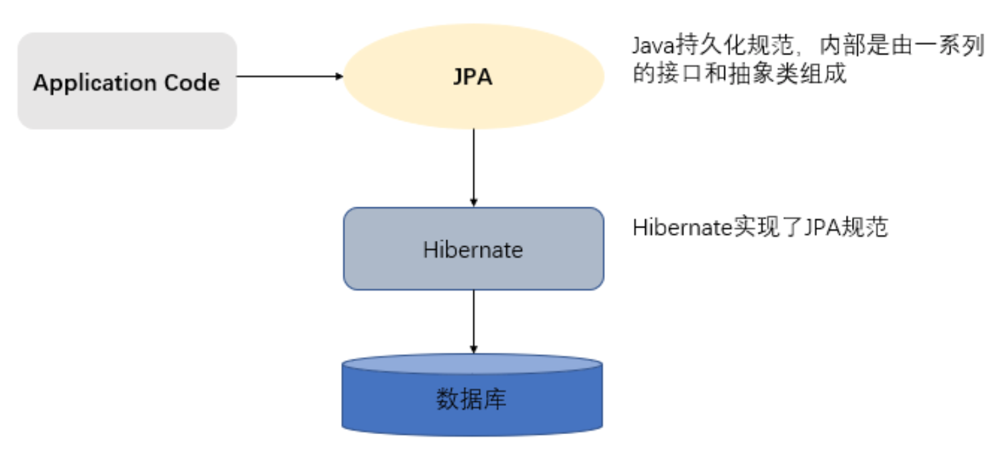
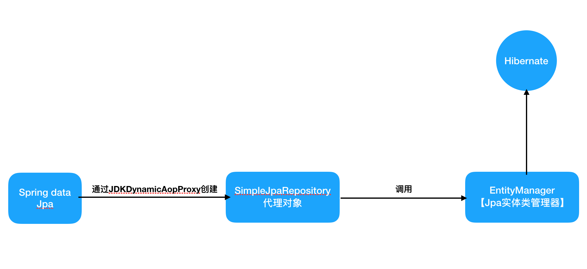

# 一、ORM思想

### 1.1 ORM概述[了解]

&emsp;&emsp;ORM（Object-Relational Mapping）对象关系映射，在面向对象的软件开发中，通过ORM就可以把对象映射到关系型数据库。只要建立ORM关系，操作对象就可以直接操作数据库数据。

> **简单的说**：ORM就是建立实体类和数据库表之间的关系，从而达到操作实体类就相当于操作数据库表的目的。


### 1.2 为什么要使用ORM

&emsp;&emsp;ORM大大减少重复代码，建立了ORM关系还可以不在重点关注sql语句


# 二、Hibernate框架介绍

### 2.1 Hibernate概述

&emsp;&emsp;Hibernate是一个开放源代码的对象关系映射框架，它对JDBC进行了非常轻量级的对象封装，它将POJO与数据库表建立映射关系，是一个全自动的orm框架，hibernate可以自动生成SQL语句，自动执行，使得Java程序员可以随心所欲的使用对象编程思维来操纵数据库。


# 三、Jpa规范及使用

### 3.1 Jpa概述

&emsp;&emsp;JPA的全称是Java Persistence API， 即Java 持久化API，是SUN公司推出的一套基于ORM的规范，**内部是由一系列的接口和抽象类构成。**

&emsp;&emsp;JPA通过JDK 5.0注解描述对象－关系表的映射关系，并将运行期的实体对象持久化到数据库中。


### 3.2 Jpa的优势

**1.** **标准化**

 &emsp;&emsp;JPA 是 JCP 组织发布的 Java EE 标准之一，因此任何声称符合 JPA 标准的框架都遵循同样的架构，提供相同的访问API，这保证了基于JPA开发的企业应用能够经过少量的修改就能够在不同的JPA框架下运行。

**2.** **容器级特性的支持**

&emsp;&emsp; JPA框架中支持大数据集、事务、并发等容器级事务，这使得 JPA 超越了简单持久化框架的局限，在企业应用发挥更大的作用。

**3.** **简单方便**

&emsp;&emsp; JPA的主要目标之一就是提供更加简单的编程模型：在JPA框架下创建实体和创建Java 类一样简单，没有任何的约束和限制，只需要使用 javax.persistence.Entity进行注释，JPA的框架和接口也都非常简单，没有太多特别的规则和设计模式的要求，开发者可以很容易的掌握。JPA基于非侵入式原则设计，因此可以很容易的和其它框架或者容器集成

**4.** **查询能力**

&emsp;&emsp; JPA的查询语言是面向对象而非面向数据库的，它以面向对象的自然语法构造查询语句，可以看成是Hibernate HQL的等价物。JPA定义了独特的JPQL（Java Persistence Query Language），JPQL是EJB QL的一种扩展，它是针对实体的一种查询语言，操作对象是实体，而不是关系数据库的表，而且能够支持批量更新和修改、JOIN、GROUP BY、HAVING 等通常只有 SQL 才能够提供的高级查询特性，甚至还能够支持子查询。

**5.** **高级特性**

&emsp;&emsp;JPA 中能够支持面向对象的高级特性，如类之间的继承、多态和类之间的复杂关系，这样的支持能够让开发者最大限度的使用面向对象的模型设计企业应用，而不需要自行处理这些特性在关系数据库的持久化。


### 3.3 Jpa与hibernate的关系

&emsp;&emsp;JPA规范本质上就是一种ORM规范，注意不是ORM框架——因为JPA并未提供ORM实现，它只是制订了一些规范，提供了一些编程的API接口，但具体实现则由服务厂商来提供实现。

&emsp;&emsp;JPA和Hibernate的关系就像JDBC和JDBC驱动的关系，JPA是规范，Hibernate除了作为ORM框架之外，它也是一种JPA实现。




### 3.4 JPA的入门案例


##### 3.4.1 引入坐标

```xml
<dependencies>
  <!-- junit -->
  <dependency>
    <groupId>junit</groupId>
    <artifactId>junit</artifactId>
    <version>4.12</version>
    <scope>test</scope>
  </dependency>

  <!-- hibernate对jpa的支持包 -->
  <dependency>
    <groupId>org.hibernate</groupId>
    <artifactId>hibernate-entitymanager</artifactId>
    <version>5.0.7.Final</version>
  </dependency>

  <!-- c3p0 -->
  <dependency>
    <groupId>org.hibernate</groupId>
    <artifactId>hibernate-c3p0</artifactId>
    <version>5.0.7.Final</version>
  </dependency>

  <!-- log日志 -->
  <dependency>
    <groupId>log4j</groupId>
    <artifactId>log4j</artifactId>
    <version>1.2.17</version>
  </dependency>

  <!-- Mysql and MariaDB -->
  <dependency>
    <groupId>mysql</groupId>
    <artifactId>mysql-connector-java</artifactId>
    <version>5.1.6</version>
  </dependency>
</dependencies>
```

##### 3.4.2 编写配置文件

&emsp;&emsp;**位置**：配置到类路径下的一个叫做`META-INF`的文件夹下。

&emsp;&emsp;**命名**：`persistence.xml`

```xml
<?xml version="1.0" encoding="UTF-8"?>
<!-- 倒入约束 -->
<persistence xmlns="http://java.sun.com/xml/ns/persistence" version="2.0">
    <!--
        需要配置persistence-unit节点
            持久化单元：
                name：持久化单元名称
                transactiong-type：事务管理的方式
                    JTA：分布式事务管理
                    RESOURCE_LOCAL：本地事务管理
     -->
    <persistence-unit name="myJpa" transaction-type="RESOURCE_LOCAL">
        <!-- jpa的实现方式 -->
        <provider>org.hibernate.jpa.HibernatePersistenceProvider</provider>

        <properties>
            <!-- 数据相关信息 -->
            <property name="javax.persistence.jdbc.user" value="root"/>
            <property name="javax.persistence.jdbc.password" value="123456"/>
            <property name="javax.persistence.jdbc.driver" value="com.mysql.jdbc.Driver"/>
            <property name="javax.persistence.jdbc.url" value="jdbc:mysql://localhost:33306/jpa_test"/>

            <!-- 可选配置，配置jpa实现方(hibernate)的配置信息:
                显示sql
                自动创建数据库表
             -->
            <property name="hibernate.show_sql" value="true"/><!-- 显示sql -->
            <!-- 自动创建数据库表，
                create：程序运行时创建数据库表（有表先删除在创建）。
                update：程序运行时创建，有表不会创建
                none：不会创建表
            -->
            <property name="hibernate.hbm2ddl.auto" value="create"/>
        </properties>
    </persistence-unit>
</persistence>
```


##### 3.4.3 实体类的相关配置

```java
/**
 * 客户实体类相关映射配置
 */
@Data
@Entity//声明此类是一个实体类
@Table(name = "cst_customer")//配置实体类和表的映射关系
public class Customer {

    @Id//主键
    @GeneratedValue(strategy = GenerationType.IDENTITY)//主键生成策略(自增)
    @Column(name = "cust_id")//配置属性和字段的映射关系
    private long custID;//客户编号（主键）

    @Column(name = "cust_name")
    private String custName;//客户名称R

    @Column(name = "cust_source")
    private String custSource;//客户来源

    @Column(name = "cust_industry")
    private String custIndustry;//客户所属行业

    @Column(name = "cust_level")
    private String custLevel;//客户级别

    @Column(name = "cust_address")
    private String custAddress;//客户联系地址

    @Column(name = "cust_phone")
    private String custPhone;//客户电话
}
```


##### 3.4.4 操作演示

```java
/**
 * Jpa操作步骤：
 * 1、加载配置文件创建工厂（实体管理类工厂）对象
 * 2、通过实体管理类工厂获取实体管理器
 * 3、获取事务对象，开始事务
 * 4、完成增删改查事务
 * 5、提交/回滚事务
 * 5、释放资源
 */
public class JpaTest {
    //工厂对象
    private EntityManagerFactory factory;
    //实体管理器对象
    private EntityManager entityManager;
    //事务对象
    private EntityTransaction transaction;
    /**
     * 测试方法之前运行，初始化一些每次测试要用的类
     */
    @Before
    public void init() {
        //1、加载配置文件创建工厂对象
        factory = Persistence.createEntityManagerFactory("myJpa");//myJpa是配置文件中的实体单元名称
        //2、获取实体管理器【数据库，实体管理器，缓存，创建数据表都在这里边】
        entityManager = factory.createEntityManager();
        //3、获取事务对象，开启事务
        transaction = entityManager.getTransaction();//获取事务对象
        transaction.begin();//开启事务
    }

    /**
     * 测试方法之后运行，释放资源
     */
    @After
    public void finallyJpa(){
        //提交事务
        transaction.commit();
        //释放资源
        entityManager.close();
        factory.close();
    }


    /**
     * 测试jpa保存
     */
    @Test
    public void testSave() {
        //创建一个客户
        Customer customer = new Customer();
        customer.setCustName("哈哈哈1");
        customer.setCustIndustry("呵呵1");

        //进行保存操作
        entityManager.persist(customer);
    }

    /**
     * 测试查询「find方法」【立即加载】
     * 使用find方法查询，查询的对象就是当前客户对象本身
     * 在调用find方法的时候就会发送sql语句查询数据库
     */
    @Test
    public void testFindById() {
        Customer customer = entityManager.find(Customer.class, 1L);
        System.out.println(customer);
    }

    /**
     * 测试查询「getReference」【延时加载】
     * 查询的对象是一个动态代理对象，调用方法不会立即发送sql语句。当调用查询结果对象时，才会发送sql语句。
     */
    @Test
    public void testReference() {
        Customer customer = entityManager.getReference(Customer.class, 1L);
        System.out.println(customer);
    }

    /**
     * 根据id删除
     */
    @Test
    public void testDeleteById() {
        //根据id查询
        Customer reference = entityManager.getReference(Customer.class, 1L);
        //然后删除
        entityManager.remove(reference);
    }

    /**
     * 更新客户的操作
     */
    @Test
    public void testUpdate() {
        //查询客户
        Customer customer = entityManager.getReference(Customer.class, 2L);
        //更新客户
        customer.setCustAddress("tttt");
        entityManager.merge(customer);
    }
}

```


### 3.5 Jpa参数配置及常用方法

##### 3.5.1 Jpa的主键生成策略

- `@GeneratedValue`
  - Strategy主键策略:
    - `GenerationType.IDENTITY`：底层数据库支持的自动增长方式自增【数据库要支持自增】
    - `GenerationType.SEQUENCE`:序列，oracle使用这个【数据库需要支持序列】
    - `GenerationType.TABLE`:Jpa提供的一种机制，通过一张数据表的形式帮助我们完成主键自增
    - `GenerationType.AUTO`:由程序自动的帮助我们选择主键生成策略


##### 3.5.2 Jpa的增删改查方法

- `find/getRefrence`:根据id查询
- `presist`:保存
- `merge`:更新
- `remove`:删除


##### 3.5.3 事务对象的常用方法

- `begin`：开启事务
- `commit`：提交事务
- `rollback`：回滚事务


##### 3.5.4 延时加载查询和立即加载查询

```java
/**
 * 测试查询「find方法」【立即加载】
 * 使用find方法查询，查询的对象就是当前客户对象本身
 * 在调用find方法的时候就会发送sql语句查询数据库
 */
@Test
public void testFindById() {
  Customer customer = entityManager.find(Customer.class, 1L);
  System.out.println(customer);
}

/**
 * 测试查询「getReference」【延时加载】
 * 查询的对象是一个动态代理对象，调用方法不会立即发送sql语句。当调用查询结果对象时，才会发送sql语句。
 */
@Test
public void testReference() {
  Customer customer = entityManager.getReference(Customer.class, 1L);
  System.out.println(customer);
}
```


### 3.6 JPQL查询

&emsp;&emsp;Java持久化查询语言(JPQL)全称Java Persistence Query Language，是一种可移植的查询语言，旨在以面向对象表达式语言的表达式，将SQL语法和简单查询语义绑定在一起。使用这种语言编写的查询是可移植的，可以被编译成所有主流数据库服务器上的SQL。

> &emsp;&emsp;简单的说Jpa用来应付一些复杂查询，而开发出的东西。和sql有异曲同工之处，语法，sql查询的是表和表中字段，jpql查询的是实体类和类中属性。

```java
/**
 * jpql查询
 */
public class JpqlTest {

    //工厂对象
    private EntityManagerFactory factory;
    //实体管理器对象
    private EntityManager entityManager;
    //事务对象
    private EntityTransaction transaction;
    /**
     * 测试方法之前运行，初始化一些每次测试要用的类
     */
    @Before
    public void init() {
        //1、加载配置文件创建工厂对象
        factory = Persistence.createEntityManagerFactory("myJpa");//myJpa是配置文件中的实体单元名称
        //2、获取实体管理器【数据库，实体管理器，缓存，创建数据表都在这里边】
        entityManager = factory.createEntityManager();
        //3、获取事务对象，开启事务
        transaction = entityManager.getTransaction();//获取事务对象
        transaction.begin();//开启事务
    }
  
    /**
     * 测试方法之后运行，释放资源
     */
    @After
    public void finallyJpa(){
        //提交事务
        transaction.commit();
        //释放资源
        entityManager.close();
        factory.close();
    }
}
```

##### 3.6.1 查询全部

- **sql：**`select * from 表名字`
- **jqpl：**`from 全限定类名`

```java
/**
 * 查询全部
 */
@Test
public void testFindAll() {
  	String jpql = "from club.maddm.pojo.Customer";
  	//接收jpql语句创建执行对象
  	Query query = entityManager.createQuery(jpql);

  	//发送查询，并封装结果集
  	List list = query.getResultList();

  	list.forEach(System.out::println);
}
```


##### 3.6.2 排序

- **sql：**`select *from 表名 order by 列名 DESC`
- **jqpl：**`from 类名 order by 属性名 desc`

```java
/**
 * 排除查询，倒叙查询全部客户
 */
@Test
public void testOrders() {
  	String jpql = "from Customer order by custID desc";
  	//接收jpql语句创建执行对象
  	Query query = entityManager.createQuery(jpql);
  	//发送查询，并封装结果集
  	List list = query.getResultList();
  
  	list.forEach(System.out::println);
}
```


##### 3.6.3 统计查询

- **sql：**`select count(列) from 表名`
- **jqpl：**`select count(属性) from 类`

```java
/**
 * 统计查询
 */
@Test
public void testCount(){
  	String jpql = " select count(custID) from Customer ";

  	Query query = entityManager.createQuery(jpql);

  	Object result = query.getSingleResult();//得到唯一结果集

  	System.out.println(result);
}
```


##### 3.6.4 条件查询

- **sql：**`select * from 表名 where 条件`
- **jqpl：**`from 类 where 条件「支持占位符」`

```java
/**
 * 条件查询
 */
@Test
public void testCondition() {
  	String jpql = "from Customer where custID = ? ";
  	//1、创建查询对象
  	Query query = entityManager.createQuery(jpql);

  	//2、设置参数
  	query.setParameter(1,2L);//第一个参数占位符位置，第二个位置：值


  	List list = query.getResultList();
  	list.forEach(System.out::println);
}
```


##### 3.6.5 分页查询

- **sql：**`select * from 表名 limit ？，？`
- **jqpl：**`from 类名`

```java
/**
 * 分页查询
 */
@Test
public void testPage(){
    String jpql = "from club.maddm.pojo.Customer";
    //1、根据jpql创建查询对象
    Query query = entityManager.createQuery(jpql);
    
    
    //2、对参数赋值
    //起始索引
    query.setFirstResult(0);//从0开始查不包含0
    //每页查询条数
    query.setMaxResults(2);
    
    //3、发送查询，并封装结果集
    List list = query.getResultList();
    list.forEach(System.out::println);
}
```


# 四、Spring Data JPA 


### 4.1 Spring data JPA 概述

&ensp;&ensp;Spring Data JPA 是 Spring 基于 ORM 框架、JPA 规范的基础上封装的一套JPA应用框架，可使开发者用极简的代码即可实现对数据库的访问和操作。它提供了包括增删改查等在内的常用功能，且易于扩展！使用 Spring Data JPA 可以极大提高开发效率！

> &emsp;&ensp;Spring Data JPA 让我们解脱了DAO层的操作，基本上所有CRUD都可以依赖于它来实现,在实际的工作工程中，推荐使用Spring Data JPA + ORM（如：hibernate）完成操作，这样在切换不同的ORM框架时提供了极大的方便，同时也使数据库层操作更加简单，方便解耦
>
> &ensp;&ensp;只写接口就能完成增删改查

### 4.2 Spring Data JPA 入门

> Spring Data Jpa只是对JPA的一套更高级的封装，而真正干活的实际还是ORM框架【例如：Hibernate】

##### 4.2.1 搭建Spring Data JPA 环境

1. 引入坐标

```xml
<properties>
    <spring.version>4.2.4.RELEASE</spring.version>
    <hibernate.version>5.0.7.Final</hibernate.version>
    <slf4j.version>1.6.6</slf4j.version>
    <log4j.version>1.2.12</log4j.version>
    <c3p0.version>0.9.1.2</c3p0.version>
    <mysql.version>5.1.6</mysql.version>
</properties>
<dependencies>
    <!-- junit单元测试 -->
    <dependency>
        <groupId>junit</groupId>
        <artifactId>junit</artifactId>
        <version>4.12</version>
        <scope>test</scope>
    </dependency>
    <!-- spring beg -->
    <dependency>
        <groupId>org.aspectj</groupId>
        <artifactId>aspectjweaver</artifactId>
        <version>1.6.8</version>
    </dependency>
    <dependency>
        <groupId>org.springframework</groupId>
        <artifactId>spring-aop</artifactId>
        <version>${spring.version}</version>
    </dependency>
    <dependency>
        <groupId>org.springframework</groupId>
        <artifactId>spring-context</artifactId>
        <version>${spring.version}</version>
    </dependency>
    <dependency>
        <groupId>org.springframework</groupId>
        <artifactId>spring-context-support</artifactId>
        <version>${spring.version}</version>
    </dependency>
    <!-- spring对orm框架的支持包-->
    <dependency>
        <groupId>org.springframework</groupId>
        <artifactId>spring-orm</artifactId>
        <version>${spring.version}</version>
    </dependency>
    <dependency>
        <groupId>org.springframework</groupId>
        <artifactId>spring-beans</artifactId>
        <version>${spring.version}</version>
    </dependency>
    <dependency>
        <groupId>org.springframework</groupId>
        <artifactId>spring-core</artifactId>
        <version>${spring.version}</version>
    </dependency>
    <!-- spring end -->
    <!-- hibernate beg -->
    <dependency>
        <groupId>org.hibernate</groupId>
        <artifactId>hibernate-core</artifactId>
        <version>${hibernate.version}</version>
    </dependency>
    <dependency>
        <groupId>org.hibernate</groupId>
        <artifactId>hibernate-entitymanager</artifactId>
        <version>${hibernate.version}</version>
    </dependency>
    <dependency>
        <groupId>org.hibernate</groupId>
        <artifactId>hibernate-validator</artifactId>
        <version>5.2.1.Final</version>
    </dependency>
    <!-- hibernate end -->
    <!-- c3p0 beg -->
    <dependency>
        <groupId>c3p0</groupId>
        <artifactId>c3p0</artifactId>
        <version>${c3p0.version}</version>
    </dependency>
    <!-- c3p0 end -->
    <!-- log end -->
    <dependency>
        <groupId>log4j</groupId>
        <artifactId>log4j</artifactId>
        <version>${log4j.version}</version>
    </dependency>
    <dependency>
        <groupId>org.slf4j</groupId>
        <artifactId>slf4j-api</artifactId>
        <version>${slf4j.version}</version>
    </dependency>
    <dependency>
        <groupId>org.slf4j</groupId>
        <artifactId>slf4j-log4j12</artifactId>
        <version>${slf4j.version}</version>
    </dependency>
    <!-- log end -->
    <dependency>
        <groupId>mysql</groupId>
        <artifactId>mysql-connector-java</artifactId>
        <version>${mysql.version}</version>
    </dependency>
    <!-- spring data jpa 的坐标-->
    <dependency>
        <groupId>org.springframework.data</groupId>
        <artifactId>spring-data-jpa</artifactId>
        <version>1.9.0.RELEASE</version>
    </dependency>
    <dependency>
        <groupId>org.springframework</groupId>
        <artifactId>spring-test</artifactId>
        <version>${spring.version}</version>
    </dependency>
    <!-- el beg 使用spring data jpa 必须引入 -->
    <dependency>
        <groupId>javax.el</groupId>
        <artifactId>javax.el-api</artifactId>
        <version>2.2.4</version>
    </dependency>
    <dependency>
        <groupId>org.glassfish.web</groupId>
        <artifactId>javax.el</artifactId>
        <version>2.2.4</version>
    </dependency>
    <!-- el end -->
</dependencies>
```


2、Spring 整合 Spring data jpa配置

```xml
<?xml version="1.0" encoding="UTF-8"?>
<beans xmlns="http://www.springframework.org/schema/beans"
       xmlns:xsi="http://www.w3.org/2001/XMLSchema-instance" xmlns:aop="http://www.springframework.org/schema/aop"
       xmlns:context="http://www.springframework.org/schema/context"
       xmlns:jdbc="http://www.springframework.org/schema/jdbc" xmlns:tx="http://www.springframework.org/schema/tx"
       xmlns:jpa="http://www.springframework.org/schema/data/jpa" xmlns:task="http://www.springframework.org/schema/task"
       xsi:schemaLocation="
		http://www.springframework.org/schema/beans http://www.springframework.org/schema/beans/spring-beans.xsd
		http://www.springframework.org/schema/aop http://www.springframework.org/schema/aop/spring-aop.xsd
		http://www.springframework.org/schema/context http://www.springframework.org/schema/context/spring-context.xsd
		http://www.springframework.org/schema/jdbc http://www.springframework.org/schema/jdbc/spring-jdbc.xsd
		http://www.springframework.org/schema/tx http://www.springframework.org/schema/tx/spring-tx.xsd
		http://www.springframework.org/schema/data/jpa
		http://www.springframework.org/schema/data/jpa/spring-jpa.xsd">

    <!-- spring 和 Spring data jpa 的配置 -->

    <!-- 1、创建entityManagerFactory对象交给Spring容器管理,该类是Spring data jpa为我们提供 -->
    <bean id="entityManagerFactory"
          class="org.springframework.orm.jpa.LocalContainerEntityManagerFactoryBean">
        <property name="dataSource" ref="dataSource"/>
        <!-- 扫描的「实体类」包,自动扫描」 -->
        <property name="packagesToScan" value="club.maddm.pojo"/>
        <!-- jpa的实现方式 -->
        <property name="persistenceProvider">
            <bean class="org.hibernate.jpa.HibernatePersistenceProvider" />
        </property>
        <!-- jpa的提供者适配器「Hibernate」 -->
        <property name="jpaVendorAdapter">
            <bean class="org.springframework.orm.jpa.vendor.HibernateJpaVendorAdapter">
                <!-- 配置是否自动创建数据库表 -->
                <property name="generateDdl" value="false" />
                <!-- 数据库类型,跟进database即可知道如何更改  -->
                <property name="database" value="MYSQL" />
                <!-- 数据库方言，支持的特有语法。【在配置的包中有各种方言】 -->
                <property name="databasePlatform" value="org.hibernate.dialect.MySQLDialect" />
                <!-- 是否展示sql -->
                <property name="showSql" value="true" />
            </bean>
        </property>
        <!-- jpa的方言：高级特性「此时配置Hibernate的高级特性」 -->
        <property name="jpaDialect">
            <bean class="org.springframework.orm.jpa.vendor.HibernateJpaDialect"/>
        </property>
    </bean>

    <!-- 2、创建数据库连接池 -->
    <bean id="dataSource" class="com.mchange.v2.c3p0.ComboPooledDataSource">
        <property name="user" value="root"/>
        <property name="password" value="123456"/>
        <property name="jdbcUrl"
                  value="jdbc:mysql://localhost:33306/jpa_test?characterEncoding=UTF-8"/>
        <property name="driverClass" value="com.mysql.jdbc.Driver"/>
    </bean>

    <!-- 3、整合Spring data jpa,mapper包和事务 -->
    <jpa:repositories base-package="club.maddm.mapper"
                      transaction-manager-ref="transactionManager"
                      entity-manager-factory-ref="entityManagerFactory"/>

    <!-- 4、配置事务管理器 -->
    <bean id="transactionManager"
          class="org.springframework.orm.jpa.JpaTransactionManager">
        <property name="entityManagerFactory" ref="entityManagerFactory"/>
    </bean>

    <!-- 5、txAdvice【配置声明式事务】 -->
    <tx:advice id="txAdvice" transaction-manager="transactionManager">
        <tx:attributes>
            <tx:method name="save*" propagation="REQUIRED"/>
            <tx:method name="insert*" propagation="REQUIRED"/>
            <tx:method name="update*" propagation="REQUIRED"/>
            <tx:method name="delete*" propagation="REQUIRED"/>
            <tx:method name="get*" read-only="true"/>
            <tx:method name="find*" read-only="true"/>
            <tx:method name="*" propagation="REQUIRED"/>
        </tx:attributes>
    </tx:advice>

    <!-- 5.aop-->
    <aop:config>
        <aop:pointcut id="pointcut" expression="execution(* club.maddm.service.*.*(..))" />
        <aop:advisor advice-ref="txAdvice" pointcut-ref="pointcut" />
    </aop:config>
    <!-- 6、配置包扫描 -->
    <context:component-scan base-package="club.maddm"/>

</beans>
```


3. 配置实体类

```java
/**
 * 客户实体类相关映射配置
 */
@Data
@Entity//声明此类是一个实体类
@Table(name = "cst_customer")//配置实体类和表的映射关系
public class Customer {

    @Id//主键
    @GeneratedValue(strategy = GenerationType.IDENTITY)//主键生成策略(自增)
    @Column(name = "cust_id")//配置属性和字段的映射关系
    private long custID;//客户编号（主键）

    @Column(name = "cust_name")
    private String custName;//客户名称R

    @Column(name = "cust_source")
    private String custSource;//客户来源

    @Column(name = "cust_industry")
    private String custIndustry;//客户所属行业

    @Column(name = "cust_level")
    private String custLevel;//客户级别

    @Column(name = "cust_address")
    private String custAddress;//客户联系地址

    @Column(name = "cust_phone")
    private String custPhone;//客户电话
}
```


4. 编写Dao接口

&emsp;&emsp;`JpaRepository<实体类,主键类型>, JpaSpecificationExecutor<实体类>`：前者封装了基本CRUD，后者封装了复杂操作。

```java
public interface CustomerMapper
        extends JpaRepository<Customer,Long>, JpaSpecificationExecutor<Customer>{
}
```


##### 4.2.2 完成基本的增删改查

```java
@RunWith(SpringJUnit4ClassRunner.class)//声明Spring提供的单元测试环境
@ContextConfiguration(locations = "classpath:applicationContext.xml")//指定Spring容器的配置信息
public class DaoTest {
    @Autowired
    private CustomerMapper customerMapper;

    /**
     * 根据id查询
     */
    @Test
    public void testFindOne() {
        Customer customer = customerMapper.findOne(3l);
        System.out.println(customer);
    }
    /**
     * 测试保存/更新：根据传递的对象是否存在主键id判断更新还是新增
     */
    @Test
    public void testSaveOrUpdate() {
        Customer customer = new Customer();
        customer.setCustName("aaa【改过】");
        customer.setCustAddress("hhh");
//        customer.setCustID(5L);

        Customer save = customerMapper.save(customer);
        System.out.println(save);
    }
    /**
     * 测试根据id删除
     */
    @Test
    public void testDelete(){
        customerMapper.delete(5L);
    }
    /**
     * 查询所有
     */
    @Test
    public void testFindAll(){
        customerMapper.findAll().forEach(System.out::println);
    }
}
```


### 4.3 Spring Data JPA 原理

&emsp;&emsp;`mybatis`也好，`Spring Data Jpa`也罢，都是通过**动态代理**的形式去生成`dao层`实现类对象。`Spring Data Jpa`最后就是调用了`Jpa`方法去完成操作的，而我们的`Jpa`是由`Hibernate`实现的。



### 4.4 Spring Data JPA 复杂查询

##### 4.4.1 jpql的使用

&emsp;&emsp;在`mapper`中定义方法，打上`@Query`注解。


##### 4.4.2 统计与 懒加载及Jpql和sqk查询

1. `Mapper`方法的定义

```java
/**
 * 可以根据命名规则查询
 */
public interface CustomerMapper
        extends JpaRepository<Customer,Long>, JpaSpecificationExecutor<Customer>{

    /**
     * 根据客户名称查询客户
     */
    //@Query(" from Customer where custName = ? ")
    public Customer findByCustName(String custName);

    /**
     * 根据客户名称和客户id查询
     */
    @Query(" from Customer where custName = ?1 and custId = ?2 ")
    public Customer findByCustNameAndAndCustId(String name,Long id);

    /**
     * 根据id更新客户名称
     */
    @Modifying//代表当前方法为更新操作
    @Query(" update Customer set custName = ?2 where custId = ?1 ")
    public void updateById(Long id,String custName);

    //==========================以下是sql=============================//
    /**
     * 查询全部
     * nativeQuery：false【默认】：jpql，true:sql
     */
    @Query(nativeQuery = true,value = " select * from cst_customer ")
    public List<Object[]> sqlFindAll();//可以是Object数组也可以是实体类对象

    /**
     * 根据名称模糊查询
     */
    @Query(nativeQuery = true,value = " select * from cst_customer where cust_name like ? ")
    public List<Customer> sqlBlurryFindByName(String name);
}
```

2. 测试方法

```java
/**
 * 复杂查询演示
 */
@RunWith(SpringJUnit4ClassRunner.class)
@ContextConfiguration("classpath:applicationContext.xml")
public class ComplexQueryTest {

    @Autowired
    private CustomerMapper customerMapper;

    /**
     * 统计查询
     */
    @Test
    public void testCount() {
        long count = customerMapper.count();
        System.out.println(count);
    }

    /**
     * 查询判断Id为4的客户是否存在
     * 实现方式：统计一下Id为4的客户总数，大于0为存在
     */
    @Test
    public void textExists() {
        boolean b = customerMapper.exists(4l);
        System.out.println(b ? "存在" : "不存在");
    }

    /**
     * 根据id查询【懒加载】
     */
    @Test
    @Transactional//需要加上事务的支持，保证getone正常运行,jpa的懒加载需要一点事务支持
    public void testGetOne() {
        Customer customer = customerMapper.getOne(4L);
        System.out.println(customer);
    }

    //=========================== jpql ================================//

    /**
     * 测试根据客户名查询
     */
    @Test
    public void testJpqlFindByName() {
        Customer byCustName = customerMapper.findByCustName("哈哈哈1");
        System.out.println(byCustName);
    }

    /**
     * 测试根据客户名称和id查询
     */
    @Test
    public void testJpqlFindByNameAndID() {
        Customer byCustNameAndAndCustID =
                customerMapper.findByCustNameAndAndCustId("哈哈哈1", 2l);
        System.out.println(byCustNameAndAndCustID);
    }

    /**
     * 测试根据id更新名字
     *  Spring Data jpa更新删除必须加上事务但是默认回滚
     */
    @Test
    @Transactional//更新/删除 需要事务
    @Rollback(value = false)//不自动回滚
    public void testjpqlUpdateNameById() {
        customerMapper.updateById(2l,"哈哈哈1[改了]");
    }

    //============================== sql =============================//
    /**
     * 测试查询全部
     */
    @Test
    public void testSqlFindAll() {
        customerMapper.sqlFindAll().forEach(obj->{
            System.out.println(Arrays.toString(obj));
        });
    }

    /**
     * 模糊查询
     */
    @Test
    public void TestSqlFuzzyQuery() {
        customerMapper
                .sqlBlurryFindByName("%改%")
                .forEach(System.out::println);
    }
}
```


### 4.5 Spring Data Jpa动态查询

&emsp;&emsp;`Specification` + `Pageable` + `Sort`就是相当于Mp中的条件构造器，后两者分别是分页和排序构造器。

##### 4.5.1 Specification 的使用

&emsp;&emsp;需要实现以下方法

```java
Predicate toPredicate(Root<T> root, CriteriaQuery<?> query, CriteriaBuilder cb);
```

- `root`参数：查询的跟对象（查询的任何属性都可以从跟对象中获取）
- `criteriaQuery`参数：顶层查询对象，自定义查询方式【一般不用】
- `criteriaBuilder`参数：查询的构造器，封装了很多的查询条件【模糊，精准】。

```java
@RunWith(SpringJUnit4ClassRunner.class)
@ContextConfiguration("classpath:applicationContext.xml")
public class SpecTest {
    @Autowired
    private CustomerMapper customerMapper;
    /**
     * 根据条件，查询单个对象
     */
    @Test
    public void testSpec() {
        Specification<Customer> spec = new Specification<Customer>() {
            @Override
            public Predicate toPredicate(Root<Customer> root, CriteriaQuery<?> query, CriteriaBuilder cb) {
                //1、获取比较属性
                Path<Object> custName = root.get("custName");
                //2、构造查询条件
                Predicate predicate = cb.equal(custName, "哈哈哈1[改了]");//equal精准匹配
                return predicate;
            }
        };
        Customer customer = customerMapper.findOne(spec);
    }
    /**
     * 多条件查询
     */
    @Test
    public void testManySpec() {
        Customer one = customerMapper.findOne((root, query, cb) -> {
            //1、创建条件1
            Predicate name = cb.equal(root.get("custName"), "哈哈哈1[改了]");
            //2、创建条件2
            Predicate id = cb.equal(root.get("custId"), 2l);
            Predicate and = cb.and(name, id);
            return and;
        });
        System.out.println(one);
    }
    /**
     * 模糊查询
     */
    @Test
    public void testSpecLike() {
        customerMapper.findAll(
                (root, query, cb) -> cb.like(root.get("custName"),"%改%")
        ).forEach(System.out::println);
    }
    /**
     * 排序查询
     */
    @Test
    public void testSpecSort() {
        //参数1：顺序，参数2：属性名
        Sort sort = new Sort(Sort.Direction.DESC,"custId");


        customerMapper.findAll(
                (root, query, cb) -> cb.like(root.get("custName"),"%改%"),sort
        ).forEach(System.out::println);
    }
    /**
     * 分页查询
     */
    @Test
    public void testSpecLimit() {
        //创建PageRequest对象，参数1：查询页数，参数2：每页数量
        Pageable pageable = new PageRequest(0,2);//0为第一页
        Page<Customer> page = customerMapper.findAll(null, pageable);


        System.out.println(page.getTotalElements());//获取总条数
        System.out.println(page.getTotalPages());//得到总页数

        page.getContent().forEach(System.out::println);//遍历集合
    }
}
```


### 4.6 Spring Data Jpa多表操作

##### 4.6.1 一对多

1. **使用注解的形式配置一对多关系**
   - 声明关系：`@OneToMany`、`@ManyToOne`
     - `targetEntity`：对方对象对象的字节码
     - `mappedBy`:放弃外建维护权。**【需要配置对方配置属性名】**
     - `cascade`：配置级联
       - `CascadeType.all`:所有
       - `CascadeType.MERGE`:更新
       - `CascadeType.PERSIST`:保存
       - `CascadeType.REMOVE`:删除
   - 配置外建：`@JoinColumn`
     - `name`：外建字段名称
     - `referencedColumnName`:参照的主表的主键子段名称

> 注意：尽可能不要用`@Data`注解，会出现循环依赖的问题

2. 配置演示


&emsp;&emsp;**客户表一对多配置**

```java
@Entity
@Table(name="cst_customer")
public class Customer {

    @Id
    @GeneratedValue(strategy = GenerationType.IDENTITY)
    @Column(name="cust_id")
    private Long custId;
    @Column(name="cust_address")
    private String custAddress;
    @Column(name="cust_industry")
    private String custIndustry;
    @Column(name="cust_level")
    private String custLevel;
    @Column(name="cust_name")
    private String custName;
    @Column(name="cust_phone")
    private String custPhone;
    @Column(name="cust_source")
    private String custSource;

    //配置客户和联系人之间的关系（一对多关系）
//    @OneToMany(targetEntity = LinkMan.class)
//    @JoinColumn(name = "lkm_cust_id",referencedColumnName = "cust_id")
    @OneToMany(mappedBy = "customer",cascade = CascadeType.ALL,fetch = FetchType.LAZY)
    private Set<LinkMan> linkMans = new HashSet<>();
}
```


&emsp;&emsp;**联系人表多对一**

```java
@Entity
@Table(name = "cst_linkman")
public class LinkMan {
  
    @Id
    @GeneratedValue(strategy = GenerationType.IDENTITY)
    @Column(name = "lkm_id")
    private Long lkmId; //联系人编号(主键)
    @Column(name = "lkm_name")
    private String lkmName;//联系人姓名
    @Column(name = "lkm_gender")
    private String lkmGender;//联系人性别
    @Column(name = "lkm_phone")
    private String lkmPhone;//联系人办公电话
    @Column(name = "lkm_mobile")
    private String lkmMobile;//联系人手机
    @Column(name = "lkm_email")
    private String lkmEmail;//联系人邮箱
    @Column(name = "lkm_position")
    private String lkmPosition;//联系人职位
    @Column(name = "lkm_memo")
    private String lkmMemo;//联系人备注
  
    @ManyToOne(targetEntity = Customer.class,fetch = FetchType.LAZY)
    @JoinColumn(name = "lkm_cust_id",referencedColumnName = "cust_id")
    private Customer customer;
}
```


&emsp;&emsp;**测试类**

```java
@RunWith(SpringJUnit4ClassRunner.class)
@ContextConfiguration("classpath:applicationContext.xml")
public class One2Many {

    @Autowired
    private CustomerMapper customerMapper;
    @Autowired
    private LinkmanMapper linkmanMapper;


    /**
     * 保存一个客户，保存一个联系人
     */
    @Test
    @Transactional
    @Rollback(false)//开启事务，关闭自动回滚
    public void testAdd() {
        Customer customer = new Customer();
        customer.setCustName("百度");

        LinkMan linkman = new LinkMan();
        linkman.setLkmName("小李");

        //添加关系【由于一的一方要维护外建，会发送多余update语句】（配置两条的原因,@Data注解可能会导致错误）
        linkman.setCustomer(customer);
        customer.getLinkMans().add(linkman);


        customerMapper.save(customer);
        linkmanMapper.save(linkman);
    }


    /**
     * 保存一个客户的同时保存所有联系人
     */
    @Test
    @Transactional
    @Rollback(false)//开启事务，关闭自动回滚
    public void testCascadeAdd() {
        Customer customer = new Customer();
        customer.setCustName("百度");

        LinkMan linkman = new LinkMan();
        linkman.setLkmName("小李1");

        LinkMan linkman2 = new LinkMan();
        linkman2.setLkmName("小李2");

        customer.getLinkMans().add(linkman);
        customer.getLinkMans().add(linkman2);
      
        customerMapper.save(customer);
    }
    /**
     * 保存一个客户的同时保存所有联系人
     */
    @Test
    @Transactional
    @Rollback(false)//开启事务，关闭自动回滚
    public void testCascadeDel() {
        Customer one = customerMapper.findOne(1l);
        customerMapper.delete(one);
    }
}
```


##### 4.6.2 多对多

- `@JoinTable`注解：配置中间表：
  - `name`：中间表表名
  - `joinColumns`：当前对象在中间表中的外建
    - `@joinColumn`:
      - `name`：中间表列名
      - `referencedColumnName`:对应的外建名
  - `inverseJoinColumns`：对方对象在中间表中的外建
    - `@joinColumn`:
      - `name`：中间表列名
      - `referencedColumnName`:对应的外建名


&emsp;&emsp;**JavaBean的配置**

```java
//======================================== 用户Pojo ==================================//
@Entity
@Table(name = "sys_user")
public class User {
    @Id
    @GeneratedValue(strategy = GenerationType.IDENTITY)
    @Column(name = "user_id")
    private Long userId;
    @Column(name = "user_name")
    private String userName;
    @Column(name = "user_age")
    private Integer age;

    /*
        配置多对多映射关系:
            1、声明表关系，配置中间表
     */
    @ManyToMany(targetEntity = Role.class,cascade = CascadeType.ALL)//打开级联
    @JoinTable(
            name = "sys_user_role",//name：中间表名称.
            joinColumns = {//当前对象在中间表中的外建【name:自定义表列名，rcn是对应的列名】
                    @JoinColumn(name = "sys_user_id",referencedColumnName = "user_id")
            },
            inverseJoinColumns = {//对方对象在中间表中的外键
                    @JoinColumn(name = "sys_role_id",referencedColumnName = "role_id")
            }
    )
    private Set<Role> roles = new HashSet<>();
}

//======================================== 角色Pojo ==================================//

@Entity
@Table(name = "sys_role")
public class Role {
    @Id
    @GeneratedValue(strategy = GenerationType.IDENTITY)
    @Column(name = "role_id")
    private Long roleId;
    @Column(name = "role_name")
    private String roleName;

    //配置多对多,放弃维护权利
    @ManyToMany(mappedBy = "roles")
    private Set<User> users = new HashSet<>();
}
```


&emsp;&emsp;**测试类**

```java
@RunWith(SpringJUnit4ClassRunner.class)
@ContextConfiguration(locations = "classpath:applicationContext.xml")
public class Many2ManyTest {

    @Autowired
    private UserMapper userMapper;
    @Autowired
    private RoleMapper roleMapper;

    /**
     * 多对多添加
     */
    @Test
    @Transactional
    @Rollback(false)
    public void testAdd() {
        User user = new User();
        user.setUserName("小李");

        Role role = new Role();
        role.setRoleName("苍蓝猛兽");

        user.getRoles().add(role);
        role.getUsers().add(user);

        userMapper.save(user);
        roleMapper.save(role);
    }
    /**
     * 级联添加
     */
    @Test
    @Transactional
    @Rollback(false)
    public void testCascadeAdd() {
        User user = new User();
        user.setUserName("小李");

        Role role = new Role();
        role.setRoleName("苍蓝猛兽");

        user.getRoles().add(role);

        userMapper.save(user);
    }
    /**
     * 级联删除
     */
    @Test
    @Transactional
    @Rollback(false)
    public void testCascadeDel() {
        List<User> all = userMapper.findAll();
        all.forEach(user->userMapper.delete(user));
    }
}
```


##### 4.6.2 导航查询

> 默认情况下导航查询对多就是`懒加载`，对一就是`立即加载`

- 再声明关系的注解上使用`@OneToMany`、`@ManyToOne`等等
  - `fetch`：配置关联对象的加载方式
    - `FetchType.EAGER`：立即加载
    - `FetchType.LAZY`：延迟加载

```java
@OneToMany(mappedBy = "customer",cascade = CascadeType.ALL,fetch = FetchType.LAZY)
private Set<LinkMan> linkMans = new HashSet<>();
```

&emsp;&emsp;**测试类**

```java
@RunWith(SpringJUnit4ClassRunner.class)
@ContextConfiguration("classpath:applicationContext.xml")
public class ObjectQueryTest {
    @Autowired
    private CustomerMapper customerMapper;
    @Autowired
    private LinkmanMapper linkmanMapper;


    //======================== 从一查多=================================//

    /**
     * 测试对象导航查询（查询一个时查出所有关联对象）【延时加载】
     * could not initialize proxy - no Session错误加上事务解决
     */
    @Test
    @Transactional
    public void testQueryObj() {
        //查询出用户
        Customer one = customerMapper.getOne(1l);
        //对象导航查询他的所有联系人
        one.getLinkMans().forEach(System.out::println);
    }

    /***
     * 对象导航查询【立即加载】
     */
    @Test
    @Transactional
    public void testQueryObjNow() {
        //查询出用户
        Customer one = customerMapper.findOne(1l);
        //默认就是延迟加载【通过配置可更改】
        Set<LinkMan> linkMans = one.getLinkMans();

        System.out.println(linkMans.size());
    }


    //======================== 从多查一=================================//

    /**
     * 对象导航查询，从一的一方 查多【默认就是立即加载】
     */
    @Test
    @Transactional
    public void testManyQueryOne() {
        LinkMan one = linkmanMapper.findOne(2l);

        //此处就是默认立即加载，可配置【fetch】
        Customer customer = one.getCustomer();
        System.out.println(customer);
    }
}
```

