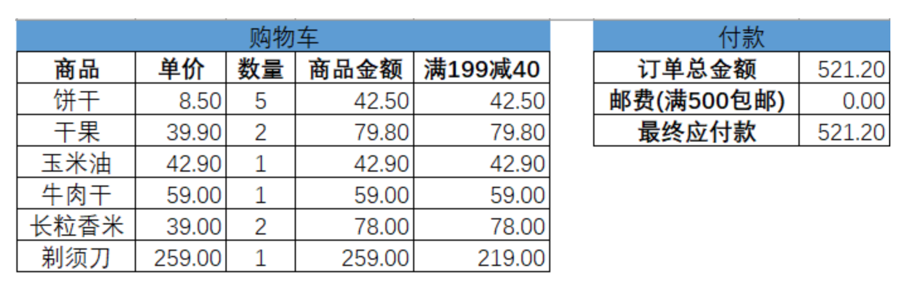
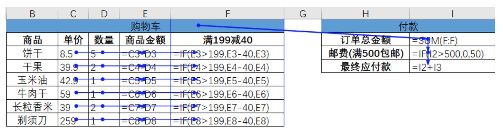
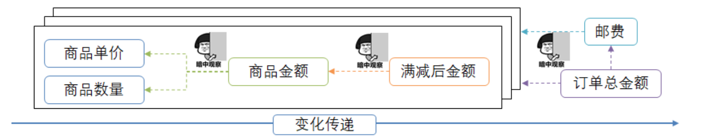
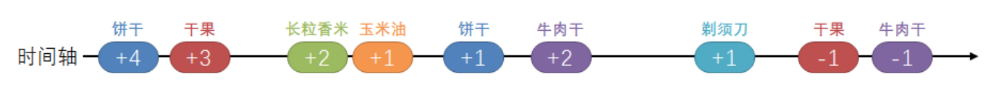

# 响应式编程简介

## 1、什么是响应式编程

&emsp;&emsp;响应式编程（`Reactive Programming`）在讨论前先看一下经常接触的“响应式典范”——电子表格。

**Excel记账的例子：**

> 以上就是使用`Excel`公式的结果。

### 1.1 变化传递（propagation of change）

&emsp;&emsp;变换传递，响应式的核心特点之一。就按照以上例子来说，**单价和数量的任何变动，都会被引用(“监听”)它的单元格实时更新计算结果。**这就是变换传递。

> 就是**一种生产者只负责生成并发出数据/事件，消费者来监听并负责定义如何处理数据/事件的变换传递方式。**

### 1.2 数据流（data stream）

&emsp;&emsp;响应式的另一个核心特点，基于数据流。响应式编程的`数据/事件`都是以数据流的形式发出的。

> 就类似于购物车，有加有减。每次都会触发相应的事件。数据就像一条数据流从头流向尾

### 1.3 声明式（declarative）

&emsp;&emsp;响应式的第三核心特点，就类似于`Stream`流。**声明式编程范式的威力在于以不变应万变**

### 总结：

**&emsp;&emsp;响应式编程（reactive programming）是一种基于数据流（data stream）和变化传递（propagation of change）的声明式（declarative）的编程范式。**

**编程范式让Web应用变得`reactive`:**

&emsp;&emsp;场景：底层数据 —> 持久层 —> 服务层 —> MVC层的Model —>前端界面。全部按照声明式的编程范式，从而搭建一条能够传递变化的管道。

&emsp;&emsp;此时日志监控系统，再也不需要“命令式”的论处查询了，而是数据从后台流向页面。社交平台的动态、点赞、留言不再是手动刷，而是后台数据变化的时候自动体现到页面上。