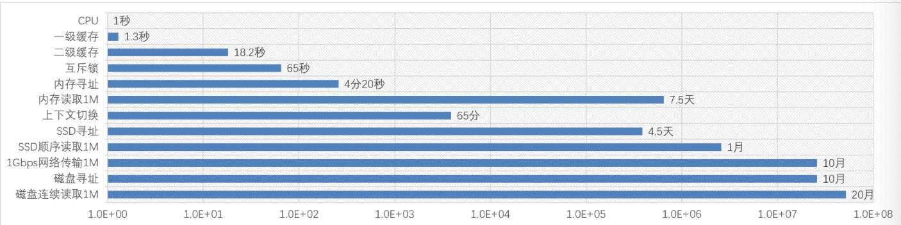
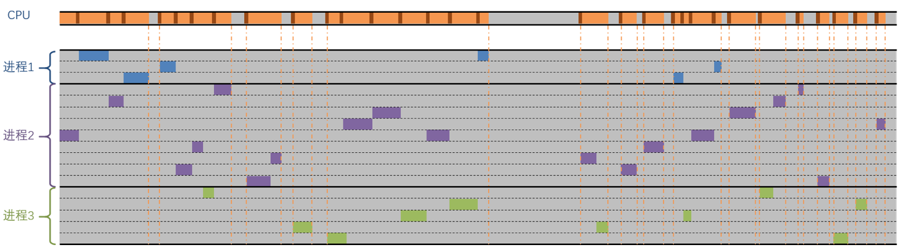
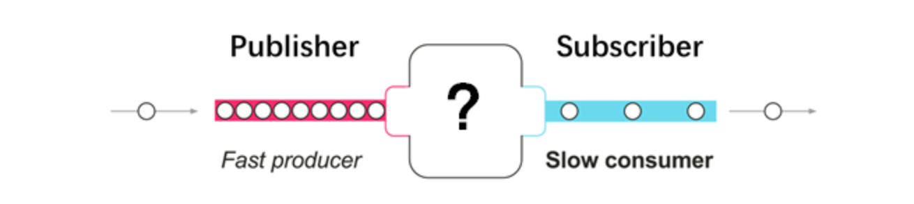
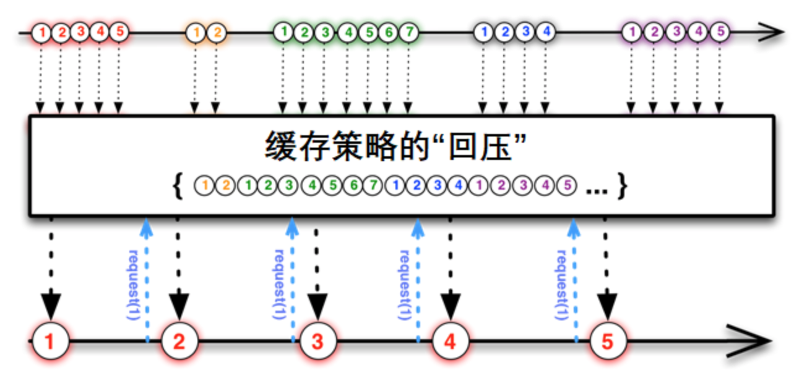
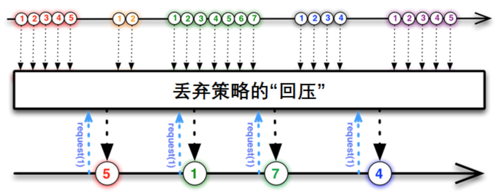

# 响应式流

## 1、为什么用响应式流

&emsp;&emsp;`Reactor`为什么没有用`Java Sream`来进行数据流的操作。原因是其在响应式编程中，是有局限性的。

**局限：**

1. Web应用具有`I/O`密集的特点，`I/O`阻塞会带来比较大的性能损失或资源浪费，所以需要的是一种**异步非阻塞**的响应式库。而`Java Stream`是一种同步的`API`。
2. 假设要搭建从**数据层到前端的一个变化传递管道**，可能遇到数据层每秒上千次的数据更新，而显然不需要向前端传每一次更新，这时候需要一种**流量控制**的能力。而`Java Stream`不具备这样的能力。

### 1.1 响应式流（Reactive Stream）

&emsp;&emsp;具备了“异步非阻塞”特性和“流量控制”能力的数据流，称之为响应式流。目前简单介绍两个实现了响应式流规范的`Java`库：`RxJava`、`Reactor`。

1. **RxJava：**源自`ReactiveX`，最初是`LINQ`的一个扩展，由微软的架构`Erik Meijer`领导开发。12年开眼，RX是一个编程模型，目标提供一致的编程接口。近年越来越流行，已经支持了很多语言。包括`RxJS`、`RxJava`。**倾向于`Android`端开发。**
2. **Reactor：**`Pivotal`旗下的项目，与Spring是兄弟关系。`WebFlux`的"御用"响应式流。`Reactor`支持响应式流规范，与`RxJava`相比，他没有历史包袱，专注于`Server`端的响应式开发。

> &emsp;&emsp;Java社区一些大牛指定的`响应式流规范`，`RxJava`团队后续进行了重构形成了兼容规范的`RxJava2`。
>
> &emsp;&emsp;Java9版本中，响应式流的规范纳入了JDK中。相应的API接口是`java.util.concurrent.Flow`。
>
> &emsp;&emsp;`Reactor`是基于规范开发的，目前版本是`Reactor3`。

### 1.2 异步非阻塞

&emsp;&emsp;在如今互联网时代的背景下，`Web`应用通常要面对高并发、海量数据的挑战，性能从来都是必须要考量的核心因素。而阻塞就是性能杀手之一。

&emsp;&emsp;`Http`服务本质上是对资源的操作，尤其是RestFul兴起之后，所谓资源就是服务器的数据。随着互联网应用、大数据的发展、访问量增多、网络眼吹，数据存取的阻塞情况越来越成为一种问题。【很多开发者认为阻塞不是什么问题，读写文件和数据库很快。】

**从调用者和服务提供者的角度：**

- **阻塞：**反应的是调用者的状态，当调用者调用了服务提供者的方法后，一直等待结果返回，否则无法执行后续操作。
- **非阻塞：**调用之后直接返回，从而可以继续执行后续操作。
- **异步：**当调用者调用了服务提供者的方法后，如果服务提供者能够立马返回，并在处理完成后通过某种方式通知调用者。可以理解为异步
- **同步：**服务提供者处理完成后才返回，或者需要调用者再去主动查询处理是否完成。就是同步。

#### 1.2.1、I/O到底有多慢

&emsp;&emsp;Cpu世界的“秒”概念，它的时钟跳一下就是一秒。

**`CPU`执行分析：**

- **cpu密集型处理：**
  - 一秒完成一个执行，发咋动作可能需要多个指令
  - 一级缓存能够跟上Cpu的速度。**秒懂CPU**
  - 二级缓存**十几秒**能“CPU”的点
  - 跟内存请求的数据通常要4-5分钟才能找到。（内存寻址）
- **I/O密集型处理：**
  - 每次找`SSD`拿东西，需要4-5天才能找到（寻址），等到数据过来几周都过去了。机械硬盘需要10个月才能找到，读取`1M`数据要20个月。
  - 关于网卡。前兆网卡,CPU想要发送`1K`的数据，最快七八个小时，但是这个`1K`数据还需要层层包裹，且每次网络通信需要协议握手等等步骤。需要花掉很多时间。发送到异地可能要花费几年的时间。

**I/O时间条：**

对阻塞造成的性能损失，两种解决思路：

1. 并行化：使用更多的线程和硬件资源。
2. 异步化：基于现有的资源来提高执行效率。

#### 1.2.2、解决阻塞的方案之一：多线程

&emsp;&emsp;由于`I/O`的同时是在太墨迹，有的时候`CPU`先生眯一觉再回来工作都不耽误。多线程就是在不同的工作间切换，如图：

**多线程的缺点：**

- 多线程切换会消耗CPU资源，图中的深褐色部分是上下文切换的时间。高并发情况下，线程数会非常多，那么上下文切换对资源的消耗会变得明显起来。切换的时候CPU并没有任何计算逻辑。
- 应对高并发环境的多线程开发相对比较难（需要掌握线程同步的原理与工具、ExecutorService、Fork/Join框架、并发集合和原子类等的使用），并且有些问题难以发现或重现（比如指令重排）
- 高并发环境，更多的线程意味着更多的内存占用（JVM默认每个线程分配1M的线程栈空间）

> &emsp;&emsp;这里并非否定多线程的功劳，Servlet3.1以前，Servlet容器会为每个接收到的请求分配一个单独的线程来处理和响应。
>
> &emsp;&emsp;随着Java版本的迭代，对并发编程的支持越来越给力，Web服务器横向扩展易如反掌，尤其是随着云计算技术和`DevOps`的普及，扩容和缩容已经可以自动化解决了。
>
> &emsp;&emsp;一直到`Node.js`出现之前，为`Java Web`带来了新的启示。Node.js只需要单线程（引擎内部多线程）就可以应对高并发的请求。**Java也可以这么搞，异步非阻塞**

#### 1.2.3、解决阻塞的方案之二：非阻塞

&emsp;&emsp;“异步非阻塞”的代码可以在不改变执行线程的情况下切换要执行的任务。基于`Java`语言的特性和`SDK`通常有两种方案：

- 回调：`Ajax`、`Callback`
- `CompletableFuture`：Java8中新增的，相对于原来的`Future`有异步回调【提供五十多种方法，Async结尾的都可以异步】和声明式【`completableFuture.thenApplyAsync(...).thenApplyAsync(...).thenAcceptAsync(...)`】。

> &emsp;&emsp;CompletableFuture的get方法不在是同步和阻塞的，而是送到需求者手中。但即便是增强了对集合的操作还是有些吃力。
>
> &emsp;&emsp;回调会导致代码不易阅读，即使使用了lambda，代码行数仍然不少。
>
> &emsp;&emsp;使用`Reactor`就可以有效的避免这两者的弊端。

### 1.3 流量控制——回压【背压】

&emsp;&emsp;响应流中，数据流的发出者叫做`Publisher`，监听者叫做`Subscriber`，我们可以称其为**“发布者”**和**“订阅者”**。

**如果发布者和订阅者处理数据的速度不一样怎么办？**

&emsp;&emsp;订阅者处理速度开还好，如果处理速度跟不上发出的速度。那么此时订阅者会被发布者产生的数据流淹没。

**此时，订阅者也需要有一种能够向上游反馈流量需求的机制：**

> 这就是**回压（`backpressure`）**，也有翻译为“背压”的。回压也会涉及到不同的策略。

#### 1.3.1 举例：缓存的策略

**如图：**

&emsp;&emsp;订阅者处理完一个元素的时候通过`request(1)`就会跟发布者在请求一个元素。由于发布者的数据不能很快被订阅者处理掉，那么发布者会将未处理的元素缓存起来。

&emsp;&emsp;这种处理方式与消息队列有相似之处，发布者需要维护一个队列用来缓存还没有被处理的元素。**这种模式用于对数据精准性要求比较高的场景**，比如发布者是突然到来的数据高峰，都是要保存到数据库的。作为订阅者的数据持久层没有那么快的处理速度，那么发布者就需要将数据暂时缓存起来。

#### 1.3.2 举例：丢弃的策略

**如图：**

&emsp;&emsp;发布者不需要缓存来不及处理的数据，而是直接丢弃。当订阅者请求数据的时候，会拿到发布者那里最近的一个数据元素。

&emsp;&emsp;比如，监控数据以每秒10个的速度产生，而前端界面只需要每秒钟更新一下监控数据即可。**此种模式适用于时效性强的场景，用不到的数据直接丢掉即可。**

## 总结：

&emsp;&emsp;以上就是响应式流的两个核心特点：**异步非阻塞**，以及基于**“回压”**机制的流量控制。这样就有了基于响应式流的**“升级版”**的响应式编程：

&emsp;&emsp;`Reactor3`和`RxJava2`都是具有以上特点的响应式流的具体实现库。

&emsp;&emsp;响应式编程通常作为面向对象编程中的**“观察者模式(Observer design pattern)”**的一种扩展。**响应式流(reactive streams)** 与 **“迭代子模式(Iterator design pattern)”**也有相通之处，因其也有Iterable-Iterator这样的对应关系，主要区别在于，`Iterator`是基于“拉取”（pull）方式的，而响应流是基于“推送”(push)方式的。

&emsp;&emsp;使用`iterator`是一种**“命令式(imperative)”**编程范式，因为什么时候获取下一个元素取决于开发者。在响应式流中，相对应角色是**“发布者 — 订阅者（Publisher — Subscriber）”**，当有新的值来的时候，反过来由发布者`Publisher`通知订阅者`Subscriber`，这种**“推送”**模式是响应式的关键。此外，对推送来的数据的操作是通过一种**声明式（declaratively）**而不是**命令式（imperatively）**的方式表达的：开发者通过描述”处理过程“来定义对数据流的处理逻辑。

