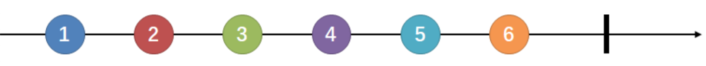
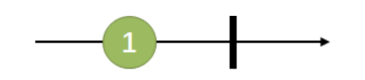
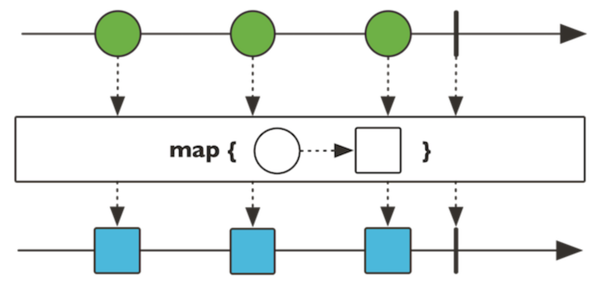
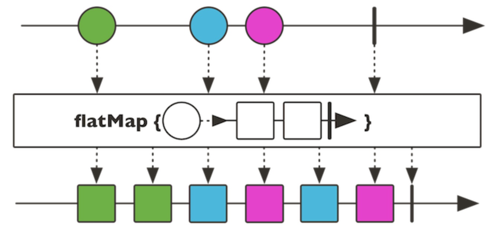
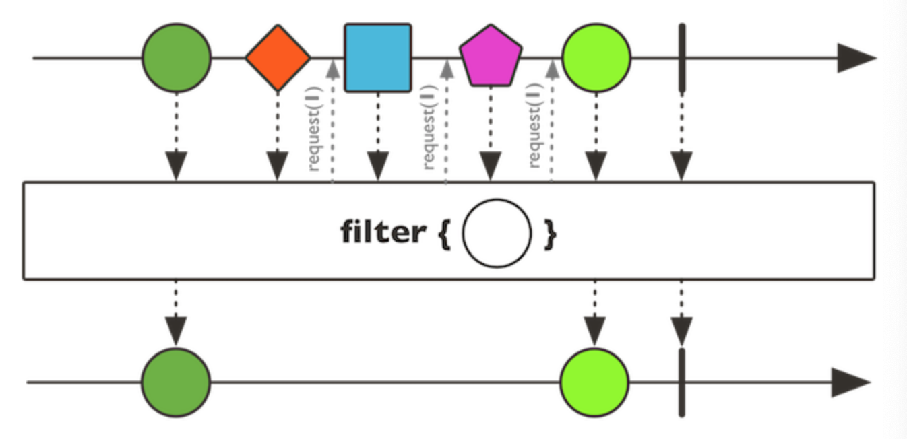
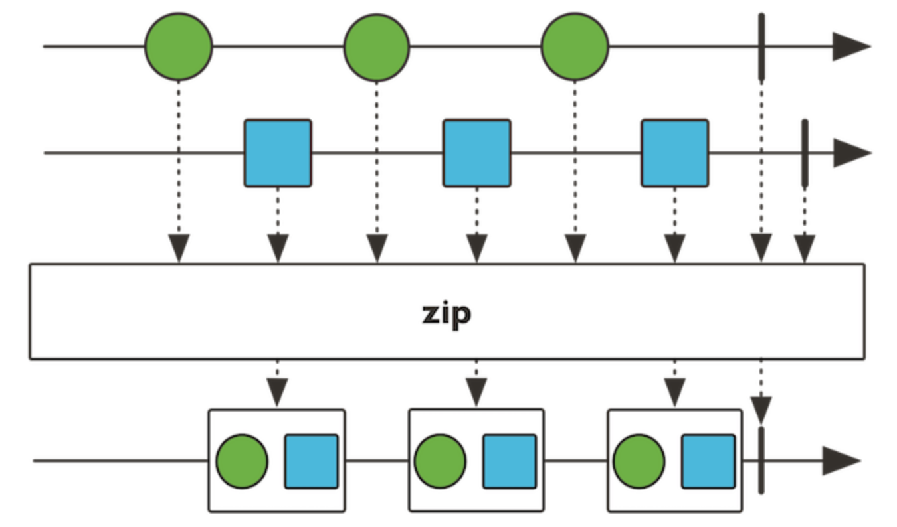

# Reactor实战

下面是`Reactor`的介绍以基本的概念和简单的使用为主，深度以能够满足基本的Spring WebFlux使用为准。

## 1、Project Reactor

&emsp;&emsp;`Project Reactor`（以下简称“Reactor”）与`Spring`是兄弟项目，侧重于Server端的响应式编程，主要`artifact`是`reactor-core`，这是一个基于Java 8的实现了**响应式流规范（Reactive Streams specification）的响应式库。**


### 1.1 Flux与Mono【Reactor中的发布者】

- `Flux`对象：代表一个包含`0..N`个元素的响应式序列。
- `Mono`对象：代表一个包含`0..1`元素的结果。

&emsp;&emsp;两个类中都提供了丰富的操作符(`operator`)，可以发出三种**“数据信号”**：`元素值`、`错误信号`、`完成信号`，错误信号和完成信号都是**终止信号**。

1. **完成信号：**用于告知下游订阅者该数据流正常结束。
2. **错误信号：**终止数据流的同时将错误传递给下游订阅者。


**Flux类型数据流图：**



&emsp;&emsp;此图表示连续的发出`1-6`共6个元素值，以及一个完成信号【加粗竖线】表示告知订阅者数据流结束。


**Mono类型数据流图：**



&emsp;&emsp;此图表示发出一个元素值后，又发出一个完成信号。【如果一个Http请求产生一个响应，对其进行“count”操作没有什么意义。这就是`Mono`存在的意义。返回应该用`Mono<HttpResponse>`而不是`Flux<<HttpResponse>>`。这样就避免了对`Mono`对象进行多元素场景下的处理】

> 选择也不是一成不变的，有些操作可以改变基数，从而需要切换类型。比如`count`操作用于`Flux`,但是操作返回的结果是`Mono<Long>`

##### 1、引入依赖

```xml
<properties>
  <project.reactor.version>3.3.3.RELEASE</project.reactor.version>
</properties>
<dependencies>
  <dependency>
    <groupId>io.projectreactor</groupId>
    <artifactId>reactor-core</artifactId>
    <version>${project.reactor.version}</version>
  </dependency>
  <dependency>
    <groupId>io.projectreactor</groupId>
    <artifactId>reactor-test</artifactId>
    <version>${project.reactor.version}</version>
    <scope>test</scope>
  </dependency>
  <dependency>
    <groupId>junit</groupId>
    <artifactId>junit</artifactId>
    <version>4.12</version>
    <scope>test</scope>
  </dependency>
</dependencies>
```

##### 2、创建两种发布者

**直接创建：**

```java
Flux<Integer> integerFlux = Flux.just(1, 2, 3, 4, 5, 6);
Mono<Integer> integerMono = Mono.just(1);
```

**基于数组、集合等生成：**

```java
Integer[] array = {1, 2, 3, 4, 5, 6};
Flux<Integer> arrayFlux = Flux.fromArray(array);
List<Integer> list = Arrays.asList(array);
Flux<Integer> iterableFlux = Flux.fromIterable(list);
Stream<Integer> stream = list.stream();
Flux<Integer> streamFlux = Flux.fromStream(stream);
```

##### 3、关于三种信号：

- 错误信号和完成信号都是终止信号，二者不能共存。
- 如果没有发出任何一个元素值，而是直接发出`完成/错误`信号，表示这是一个空数据流。
- 如果没有错误信号和完成信号，那么就是一个无限数据流。

**只有完成信号的空数据流：**

```java
Flux<Object> just = Flux.just();
Flux<Object> fluxEmpty = Flux.empty();

Mono<Object> monoEmpty = Mono.empty();
Mono<Object> orEmpty = Mono.justOrEmpty(Optional.empty());
```

**只有错误信号的数据流：**

```java
Flux<Object> fluxError = Flux.error(new Exception("some error"));
Mono<Object> monoError = Mono.error(new Exception("some error"));
```

> 空数据流的作用：
>
> - `Mono<User> findById(long id)`
> - `Flux<User> findAll()`
>
> &emsp;&emsp;从`DB`中获取结果的时候，假设`DAO`层是`ReactiveRepository<User>`，这个时候可能就是空的。
>
> &emsp;&emsp;无论是空还是异常最好都通过**完成/错误信号**告知订阅者，已经查询完毕。


##### 4、订阅

**案例：打印数据流**

```java
//1.subscribe：订阅
Flux.just(1, 2, 3, 4, 5, 6).subscribe(System.out::print);
System.out.println();
Mono.just(1).subscribe(System.out::println);
```


**Flux和Mono还提供了多个`subscribe`方法的变体：**

1. 订阅并触发数据流

   ```java
   subscribe(); 
   ```

2. 订阅并指定对正常数据元素如何处理

   ```java
   subscribe(Consumer<? super T> consumer);
   ```

3. 订阅并定义对正常数据元素和错误信号的处理

   ```java
   subscribe(Consumer<? super T> consumer,
             Consumer<? super Throwable> errorConsumer); 
   ```

4. 订阅并定义对正常数据元素、错误信号和完成信号的处理

   ```java
   subscribe(Consumer<? super T> consumer,
             Consumer<? super Throwable> errorConsumer,
             Runnable completeConsumer); 
   ```

5. 订阅并定义对正常数据元素、错误信号和完成信号的处理，以及订阅发生时的处理逻辑

   ```java
   subscribe(Consumer<? super T> consumer,
             Consumer<? super Throwable> errorConsumer,
             Runnable completeConsumer,
             Consumer<? super Subscription> subscriptionConsumer); 
   ```


**案例：处理元素、异常、完成**

```java
Flux.just(1, 2, 3, 4, 5, 6).subscribe(
                System.out::print,
                System.err::print,
                () -> System.out.println("完成")
        );

//输出：123456完成
```


**案例：错误信号处理**

```java
Mono.error(new Exception("some error")).subscribe(
                System.out::println,
                System.err::println,
                () -> System.out.println("完成")
        );
//输出：java.lang.Exception: some error
```


> **注意：**
>
> - 打印了错误信号，就没有输出完成。表明没有发出完成信号。
> - 只有订阅后才会触发数据流，**订阅前什么都不会发生。**


### 1.2 测试与调试

&emsp;&emsp;从命令式和同步式编程切换到**响应式和异步式编程**，测试也就随之变得困难。命令式编程调试都是非常直观的，直接看`stack trace`就可以找到问题出现的位置。


##### 1、StepVerifier测试工具

&emsp;&emsp;下一个期望的数据或信号是什么，期望使用`Flux`来发出某一个特别的值，或者是否接下来300ms什么都不做，这都能使用`StepVerifier API`来表示。

**简单介绍：**

```java
public class ReactorDemo {
    /**
     * 从1到6产生通量
     * @return
     */
    private Flux<Integer> generateFluxFrom1To6() {
        return Flux.just(1, 2, 3, 4, 5, 6);
    }

    /**
     * 产生Mono错误
     * @return
     */
    private Mono<Integer> generateMonoWithError() {
        return Mono.error(new Exception("some error"));
    }

    /**
     * 通过步骤验证器测试
     */
    @Test
    public void testViaStepVerifier() {
        StepVerifier.create(generateFluxFrom1To6())
                .expectNext(1, 2, 3, 4, 5, 6)//期待下一个
                .expectComplete()//验证下一个元素是否为完成信号。
                .verify();
        StepVerifier.create(generateMonoWithError())
                .expectErrorMessage("some error")//验证下一个元素是否错误信号
                .verify();
    }
}
```

- `expectNext`：测试下一个期望的数据元素
- `expectErrorMessage`：验证下一个元素是否为错误信号
- `expectComplete`：测试下一个元素是否为完成信号

> `StepVerifier`还提供了其他丰富的测试方法。


### 1.3 常用方法（操符/员【Operator】）

&emsp;&emsp;流式操作就像一条流水线，从流水线的源头进入传送带的是原料，经过处理变成消费者需要的包装品。而流水线上的的工序就相当于操作员。


#### 1、map-元素映射为新元素

&emsp;&emsp;map操作可以将数据元素进行转换/映射，得到一个新元素。



**方法定义：**

```java
public final <V> Flux<V> map(Function<? super T, ? extends V> mapper)
public final <R> Mono<R> map(Function<? super T, ? extends R> mapper)
```


**方法示例：**

```java
@Test
public void testMap(){
  StepVerifier.create(Flux.range(1, 6)
                      .map(i -> i * i))
    .expectNext(1, 4, 9, 16, 25, 36)
    .verifyComplete()
    ;
  Flux.range(1, 6).map(i -> i * i).subscribe(System.out::println);
}
```

- `Flux.range(1,6)`：用于生成 “1” 开始的，自增为1的 “6” 个整形数据。
- `verifyComplete()`：相当于`expectComplete().verify()`


#### 2、flatMap - 元素映射为流

&emsp;&emsp;将每个数据元素转换/映射为一个流，然后将这些流合并为一个大的数据流。**流的合并是异步的，并非严格按照原始序列的顺序。**



**方法定义：**

```java
public final <R> Flux<R> flatMap(Function<? super T,? extends Publisher<? extends R>> mapper)
public final <R> Mono<R> flatMap(Function<? super T,? extends Mono<? extends R>> transformer)
```


**方法示例：**

```java
@Test
public void testFlatMap() {
  StepVerifier.create(
    Flux.just("flux", "mono")
    .flatMap(
      s -> Flux.fromArray(s.split("\\s*")).delayElements(Duration.ofMillis(100))
    )
    .doOnNext(System.out::print)
  )
    .expectNextCount(8)
    .verifyComplete();
}
//打印方法：fmlounxo
```

- `Flux.fromArray`：将字符串，将其拆分为包含一个字符的字符串流。
- `delayElements`：对每个元素延迟100ms。
- `doOnNext()`：**偷窥式**方法，不会消费数据流。
- `expectNextCount`：验证是否发出了8个元素。

> &emsp;&emsp;打印结果是因为拆分后的小字符串都是间隔100ms发出的。**flatMap**通常用于每个元素又会引入数据流的情况。
>
> **例如：**
>
> ```java
> Mono<HttpResponse> requestUrl(String url) {...}
> urlFlux.flatMap(url -> requestUrl(url));//返回的内容：Flux<HttpResponse>
> ```


#### 3、filter - 过滤

&emsp;&emsp;filter操作可以对数据元素进行筛选



**方法定义：**

```java
public final Flux<T> filter(Predicate<? super T> tester) 
public final Mono<T> filter(Predicate<? super T> tester)
```

&emsp;&emsp;filter方法接受的是断言型的函数式接口为参数，这个函数式的作用是进行判断并返回`boolean`型数据。

**方法示例：**

```java
@Test
public void testFilter() {
  StepVerifier.create(
    Flux
    .range(1, 6)
    .filter(i -> i % 2 == 1)//保留奇数
    .map(i -> i * i)
  )
    .expectNext(1, 9, 25)
    .verifyComplete();
}
```


#### 4、zip - 一对一合并

&emsp;&emsp;`zip`能将多个流一对一的合并起来，其有多个方法变体。



**方法定义：**

```java
public static <T1,T2> Flux<Tuple2<T1,T2>> zip(Publisher<? extends T1> source1, Publisher<? extends T2> source2) 
public static <T1, T2> Mono<Tuple2<T1, T2>> zip(Mono<? extends T1> p1, Mono<? extends T2> p2)
```

> **注：**`Flux`的`zip`方法接受`Flux`或`Mono`为参数，`Mono`的`zip`方法只能接受`Mono`类型的参数。

**方法示例：**

```java
@Test
public void testZip() throws InterruptedException {
  CountDownLatch countDownLatch = new CountDownLatch(1);
  Flux.zip(
    getZipDescFlux(),
    Flux.interval(Duration.ofMillis(200))
  ).subscribe(t-> System.out.print(t.getT1()),null,countDownLatch::countDown);
  countDownLatch.await(10, TimeUnit.SECONDS);
}

/**
 * 返回一个将一段文字分割成Flux的方法
 * @return
 */
private Flux<String> getZipDescFlux() {
  String desc = "Zip two sources together, that is to say wait for all the sources to emit one element and combine these elements once into a Tuple2.";
  return Flux.fromArray(desc.split("\\s*"));
}
```

- `CountDownLatch`：假设传入1，则会执行1次`countDown`方法后结束，不使用它的话，测试放在所在的线程会直接返回而不会等待数据流发出完毕。
- `Flux.interval`：声明一个每200ms发出一个元素的`long`数据流。**因zip操作是一对一的，故而将其与字符串流zip之后，字符串流也将具有同样的速度。**
- `Tuple2`：zip之后流的元素类型，使用`getT1`或`getT2`方法获取元素。
- `countDownLatch::countDown`：倒数，案例中作为完成信号。
- `countDownLatch.await`：等待`countDown`倒数为0，最多等待10秒。

> 除了，`zip`方法之外，还有`zipWith()`等非静态方法。
>
> ```java
> getZipDescFlux().zipWith(Flux.interval(Duration.ofMillis(200)))
> ```
>
> **在异步的条件下，数据流的流速不同，使用`zip`能够一对一的将两个或多个数据流的元素*对齐发出***


#### 5、更多方法

- **用于生成数据流：**`create`和`generate`，及其变体方法。
- **无副作用方法：**`doOnNext`、`doOnError`、`doOnComplete`、`doOnSubscribe`、`doOnCancel`等及其变体方法。
- **数据流转换方法：**`when`、`and/or`、`merge`、`concat`、`collect`、`count`、`repeat`等及其变体方法。
- **用于过滤/拣选：**`take`、`first`、`last`、`sample`、`skip`、`limitRequest`等及其变体方法。
- **用于错误处理：**`timeout`、`onErrorReturn`、`onErrorResume`、`doFinally`、`retryWhen`等及其变体方法。
- **用于分批处理：**`window`、`buffer`、`group`等及其变体方法。
- **用于线程调度：**`publishOn`、`subscribeOn`方法。

> 使用这些操作符，基本可以搭建出能够进行任何业务需求的数据处理管道【流水线】。


### 1.4 调度器与线程模型

#### 1、回顾Java Executors工具类【线程池】

- `newCachedThreadPool`：创建一个弹性大小缓存线程池，如果线程池长度超过处理需求，可灵活回收空闲线程，若无可回收，则新建线程。
- `newFixedThreadPool`：创建一个大小固定的线程池，可控制线程最大并发数，超出的线程会在队列中等待。
- `newScheduledThreadPool`：创建一个大小固定的线程池，支持定时及周期性的任务执行。
- `newSingleThreadExecutor`：创建一个单线程化的线程池，它只会用唯一的工作线程来执行任务，保证所有任务按照指定顺序（`FIFO`、`LIFO`，优先级）执行。

> 此外，`newWorkStealingPool`还可以创建支持`work-stealing`【工作窃取算法】的线程池。


#### 2、Reactor线程管理

&emsp;&emsp;`java`提供的线程池使得我们对`ExecutorService`使用已经非常得心应手了。但`Reactor`**让线程管理和任务调度更加方便。**`Scheduler`调度器帮助我们搞定线程，

&emsp;&emsp;`Scheduler`是一个拥有多个实现类的抽象接口。`Schedulers`类提供的静态方法可以搭建出以下几种线程执行环境：

- **当前线程：**`Schedulers.immediate()`
- **可重用的单线程：**`Schedulers.single()`，注，这个方法对所有调用者都提供同一个线程来使用，知道该调度器被废弃。如果需要独占线程：`Schedulers.newSingle()`。
- **弹性线程池：**`Schedulers.elastic()`，根据需要创建一个线程池，重用空闲线程。线程池如果空闲时间过长（默认为60s）就会被废弃。对于`I/O`阻塞的场景比较适用。能够方便的给一个阻塞的任务分配它自己的线程。从而不会妨碍其他任务和资源。
- **固定大小线程池：**`Schedulers.parallel()`，所创建线程池的大小与CPU个数相同。
- **自定义线程池：**`Schedulers.fromExecutorService(ExecutorService)`基于自定义的`ExecutorService`创建`Scheduler`(也可以使用`Executor`来创建【不推荐】)。

> `Schedulers`已经预先创建了几种常见的线程池【内置】，如果像创建新的线程池，可以使用`newSingle()`、`newElastic()`和`newParallel()`方法。


#### 3、对比

- **单线程：**`Schedulers.single()`和`Schedulers.newSingle()`对应`Executors.newSingleThreadExecutor()`
- **弹性线程池：**`Schedulers.elastic()`和`Schedulers.newElastic()`对应`Executors.newCachedThreadPool()`
- **固定大小下城池：**`Schedulers.parallel()`和`Schedulers.newParallel()`对应`Executors.newFixedThreadPool()`；
- `Schedulers`提供的以上三种调度器底层都是基于`ScheduledExecutorService`的，因此都是支持任务定时和周期性执行的；
- `Flux`和`Mono`的调度操作符`subscribeOn`和`publishOn`支持work-stealing。


#### 4、举例：将同步的阻塞调用变为异步的

&emsp;&emsp;`Schedulers.elastic()`能够方便地给一个阻塞的任务分配专门的线程，从而不会妨碍其他任务和资源。那么可以利用这一点将一个同步阻塞的调用调度到一个自己的线程中，并利用订阅机制，待调用结束后异步返回。

```java
@Test
public void testSyncToAsync() throws InterruptedException {
  CountDownLatch countDownLatch = new CountDownLatch(1);
  Mono.fromCallable(this::getStringSync)
    .subscribeOn(Schedulers.elastic())
    .subscribe(
    System.out::println,
    null,
    countDownLatch::countDown
  );
  System.out.println("》》》》》》》》》》》》》》》》》》》》》》》》》》》》");
  countDownLatch.await(10, TimeUnit.SECONDS);
}

/**
 * 阻塞两秒返回字符串
 * @return
 */
private String getStringSync() {
  try {
    TimeUnit.SECONDS.sleep(2);
  } catch (InterruptedException e) {
    e.printStackTrace();
  }
  return "Hello,Reactor!";
}
```

- `fromCallable`：声明一个基于`Callable`的`Mono`。
- `subscribeOn`：将任务调度到`Schedulers`内置的弹性线程池执行，弹性线程池会为`Callable`的执行任务分配一个单独的线程。


#### 5、切换调度器的操作符

&emsp;&emsp;`Reactor`提供了两种在响应式链中调整调度器`Scheduler`的方法：`publishOn`和`subscribeOn`。两个方法都能接受`Scheduler`作为参数，从而可以改变调度器。

&emsp;&emsp;`publishOn`在链中出现的位置是有讲究的，而`subscribeOn`则无所谓。


**大致对应代码：**

```java
@Test
public void testScheduler(){
  Flux.range(1, 1000)
    .map(i -> i)
    .publishOn(Schedulers.elastic())
    .filter(i->true)
    .publishOn(Schedulers.parallel())
    .flatMap(i->Flux.just(i))
    .subscribeOn(Schedulers.single())
    ;
}
```

- `publishOn`：会影响链中其后的操作符，比如图中第一个`publishOn`调整调度器为`elastic`,则`filter`的处理操作是在弹性线程池中执行的。第二个``publishOn``之后的`flatMap`是执行在固定大小的线程池中的。
- `subscribeOn`：无论出现在什么位置，都只影响源头的执行环境。图中所示，`range`方法是执行在单线程中的。`range`后的`map`也是在单线程中执行的。

> 关于`publishOn`和`subscribeOn`为什么会出现如此的调度策略，需要深入讨论`Reactor`的实现原理。


### 1.5 错误处理

&emsp;&emsp;响应式流中，错误（error）是终止信号。当有错误发生，它会导致流序列停止，并且沿着操作链条向下传递，直到遇到`subscribe`中的错误处理方法。

**处理案例：**

```java
@Test
public void testErrorHandling() {
  Flux.range(1, 6)
    .map(i -> 10 / (i - 3))
    .map(i -> i * i)
    .subscribe(System.out::println, System.out::println)
    ;
  /*
		输出结果：
		        25
		        100
		        java.lang.ArithmeticException: / by zero
  */
}
```

&emsp;&emsp;此时通过`subscribe`通过错误信号处理已经正常退出，错误没有蔓延出去。


#### 1、回忆传统Try...catch处理异常

1. 捕获并返回一个静态的缺省值。
2. 捕获并执行一个异常处理方法或动态的计算一个候补值来顶替。
3. 捕获，并在包装为某一个业务相关的异常，然后再抛出业务异常。
4. 捕获，记录错误日志，然后继续抛出。
5. 使用`finally`来清理资源，或使用`java7`引入的`try-with-resource`。


#### 2、Reactor中的异常处理

##### 2.1 捕获并返回一个静态的缺省值

使用`onErrorReturn`方法，提供缺省值：

```java
@Test
public void testOnErrorReturn() {
  Flux.range(1, 6)
    .map(i -> 10 / (i - 3))
    .onErrorReturn(0)//提供一个缺省值0
    .map(i -> i * i)
    .subscribe(
    System.out::println,
    System.err::println
  );
  /*
     输出结果：错误后并没有输出
             25
             100
             0
	*/
}
```


##### 2.2 捕获并执行一个异常处理方法或计算一个候补值来顶替

使用`onErrorResume`方法，接收错误信号提供一个新的数据流：

```java
@Test
public void testOnErrorResume() {
  Flux.range(1, 6)
    .map(i -> 10 / (i - 3))
    .onErrorResume(
    e -> Mono.just(new Random().nextInt(6))
  )//提供新的数据流
    .map(i -> i * i)
    .subscribe(
    System.out::println,
    System.err::println
  );
  /*
     输出结果：错误后并没有输出
             25
             100
             25
  */
}
```

**具有业务含义的例子:**

```java
Flux.just(endpoint1,endpoint2)
  .flatMap(k -> callExternalService(k))// 1
  .onErrorResume(e -> getFromCache(k))// 2
```

- **1：**调用外部服务。
- **2：**如果外部服务异常，则从缓存中取值代替。


##### 2.3 捕获，并再包装为某一个业务相关的异常，然后再抛出业务异常

使用`onErrorMap`方法包装异常：

```java
Flux.just("timeout1")
  .flatMap(k -> callExternalService(k)) // 1
  .onErrorMap(original -> new BusinessException("SLA exceeded",original)) // 2
```

- **1：**调用外部服务。
- **2：**如果外部服务异常，将其包装为业务相关的异常后再次抛出。

使用`onErrorResume`实现异常的包装:

```java
Flux.just("timeout1")
  .flatMap(k -> callExternalService(k))
  .onErrorResume(original -> Flux.error(
  	new BusinessException("SLA exceeded",original)
  ))
```


##### 2.4 捕获，记录错误日志，然后继续抛出

使用`doOnError`方法记录日志，`doOnXxx`都是只读的不会对数据流造成影响。

```java
Flux.just(endpoint1,endpoint2)
  .flatMap(k -> callExternalService(k))
  .doOnError(//只读的拿到错误数据，错误信号会继续向下传递
		e -> {
      log("un on，falling back，service failed for key " + k)；//记录日志
    }
	)
  .onErrorResume(e -> getFromCache(k))
```


##### 2.5 使用finally来清理资源，或使用Java7引入的“try-with-resource”

```java
Flux.using(
	() -> getResource(),//第一个参数：获取资源
  resource -> Flux.just(resource.getAll()),//第二个参数：利用资源生成数据流
  MyResource::clean//第三个参数：最终清理资源
)
```

&emsp;&emsp;使用`doFinally`在序列终止（无论是完成信号，还是错误信号）的时候被执行。并且可以判断是什么类型的终止事件，以便针对性的清理：

```java
@Test
public void testDoFinally() {
  LongAdder statsCancel = new LongAdder(); //使用LongAdder统计

  Flux.just("foo","bar")
    .doFinally(type->{
      if (type == SignalType.CANCEL) { //检查终止信号类型
        statsCancel.increment(); //加1
      }
    })
    .take(1) //在发出一个元素后取消流
    ;
}
```


##### 2.6 重试

使用`retry`进行对错误序列进行重试。

```java
@Test
public void testRetry() throws InterruptedException {
    Flux.range(1, 6)
            .map(i -> 10 / (3 - i))
            .retry(1)
            .subscribe(
                    System.out::println,
                    System.err::println
            );
    Thread.sleep(100);
    /*
        输出结果：
            5
            10
            5
            10
            java.lang.ArithmeticException: / by zero
     */
}
```

> 注：`retry`对于上游`Flux`是才去的重订阅`(re-subscribing)`的方式，因此重试后实际上已经不是同一序列了【仍从第一个软塑开始处理】，发生错误信号的序列仍然是终止了的。


### 1.6 回压

&emsp;&emsp;上边的例子并没有进行流量控制，当执行`.subscribe(System.out.println)`订阅的时候，直接发起了一个无限请求（`unbounded request`），无论数据流中的元素快慢都**“照单全收”**。


**`subscribe`方法之一：**

```java
subscribe(Subscribe subscribe)//接收一个Subscribe为参数，可以进行更加灵活的定义
```

> &emsp;&emsp;该方法是`subscribe`方法本尊，前边介绍的可以接受0～4个函数式接口为参数的`subscribe`最终都是拼装为这个方法。


**通过自定义subscribe进行订阅：**Reactor提供了一个`BaseSubscriber`

&emsp;&emsp;假设，现在有一个非常快的`Publisher`，还有一个每秒处理一个数据元素的慢`Subscriber`。这种情况`Subscriber`就需要`request(n)`的方法来告知它的需求速度。

```java
@Test
public void testBackpressure() {
  Flux.range(1, 6)//一个快的Publisher
    .doOnRequest(
      //每次被请求数据都会打印请求个数
    	n -> System.out.println("Request " + n + "values...")
  	)
    .subscribe(
    new BaseSubscriber<Integer>() {//重写BaseSubscriber方法，根据需求自定义
      @Override//订阅时执行的操作
      protected void hookOnSubscribe(Subscription subscription) {
        System.out.println("Subscribed and make a request...");
        request(1);//订阅时向上游请求1个元素
      }

      @Override//每收到一个元素时的操作
      protected void hookOnNext(Integer value) {
        try {
          TimeUnit.SECONDS.sleep(1);//模拟慢操作
        } catch (InterruptedException e) {
          e.printStackTrace();
        }
        System.out.println("Get value [" + value + "]");//打印收到的值
        request(1);//处理完再请求一个
      }
    }
  )
    ;
}
```

**输出结果：**

```shell
Subscribed and make a request...
Request 1 values...
Get value [1] 
Request 1 values...
Get value [2] 
Request 1 values... 
Get value [3] 
Request 1 values... 
Get value [4] 
Request 1 values... 
Get value [5] 
Request 1 values...
Get value [6] 
Request 1 values...
```

> 由此也可见`range()`方法生成的`Flux`采用的是缓存的回压策略。


### 1.7 小节

&emsp;&emsp;从命令式变成到响应式编程的切换并不容易，通过本文课题体会到使用`Reactor`编程的一些特点：

- 相对于传统的基于回调和`Future`的异步开发方式，响应式编程更加具有可编排行和可读性。配合`lambda`表达式，代码简洁，处理逻辑就像流水线。
- **“冷”数据流**，在订阅（`subscribe`）时才会触发数据流。还有一种热数据流，不管是否订阅都会一直发出数据。`Reactor`中几乎都是“冷”数据流。
- **调度器对线程管理进行更高层次的抽象**，能更容易的切换线程执行环境。
- **灵活的错误处理机制**，有利于编写健壮的程序
- **回压**机制，使得订阅着可以无限接收数据并让他的源头“满负荷”推送所有数据，也可以通过使用`request`方法来告知源头它一次**最多处理的n个元素**，从而将“推送”模式转换为**“推送+拉取”**混合的模式。

> 顺变说个开心的，学完`Reactor`能够轻松上手`Rx`家族库。