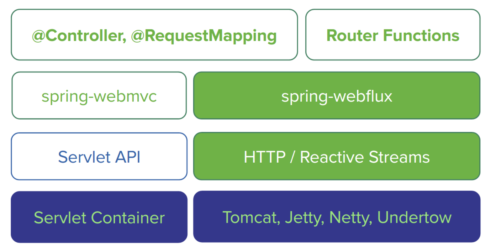
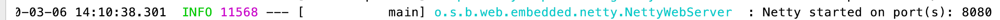
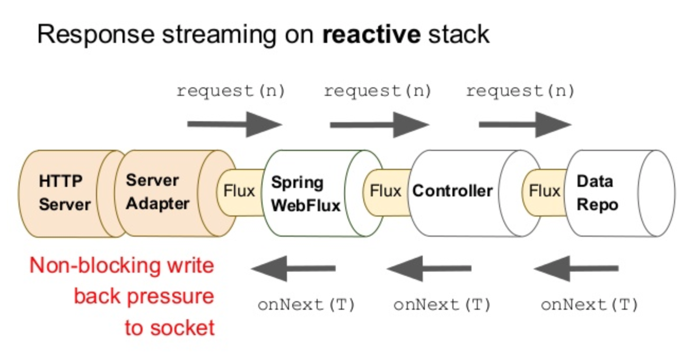
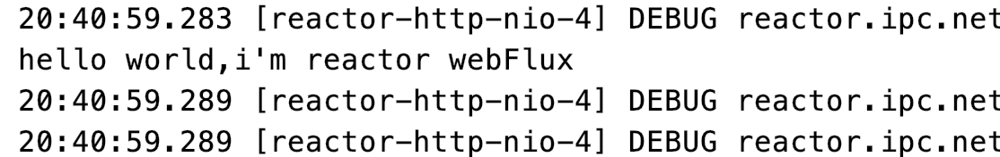
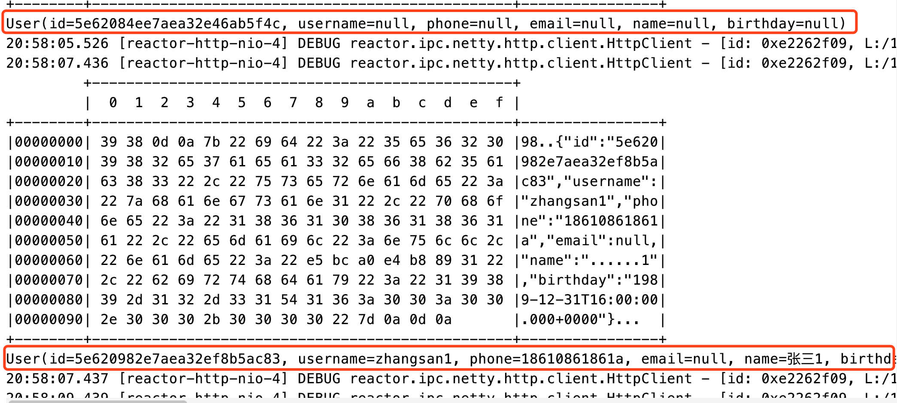
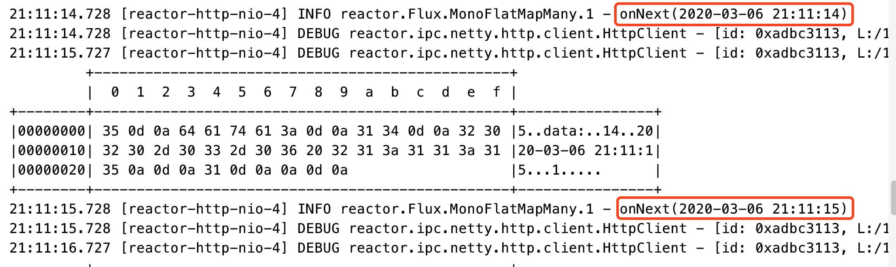
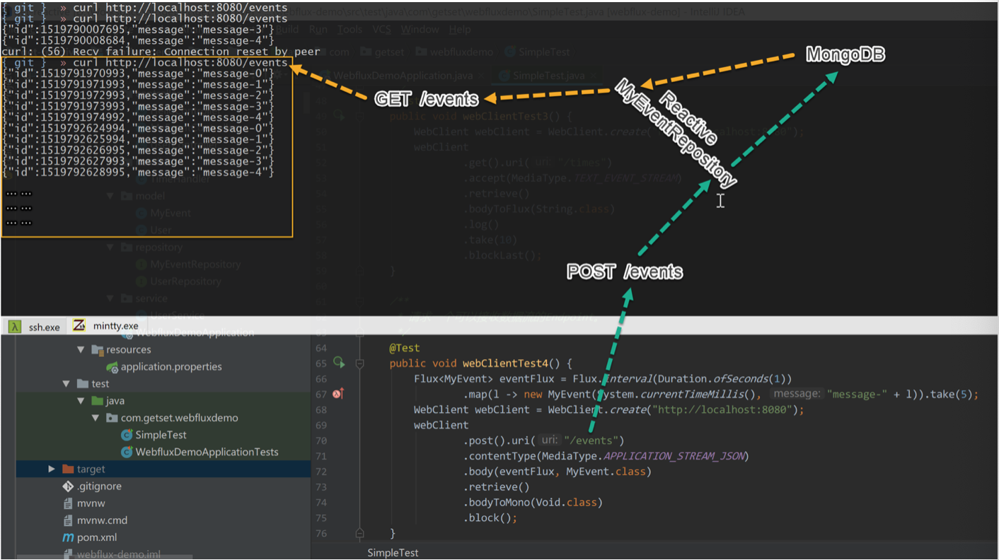

# WebFlux实战

## 1、Spring WebFlux 简介

&emsp;&emsp;`Spring WebFlux`是随`Spring 5`退出的响应式`Web`框架。




### 1.1 服务端技术栈

&emsp;&emsp;如图所示，左侧为基本`Spring-webmvc`的技术栈，右侧为基于`Spring-webflux`的技术栈，其提供了完整的响应式支持。

- `Spring WebFlux`是基于响应式流的，可以用来建立异步的、非阻塞的、事件驱动的服务。采用`Reactor`作为首选的响应式流的实现库，也提供了对`RxJava`的支持。
- **由于响应式编程的特性**，`Spring WebFlux`和`Reactor`底层需要支持异步的运行环境，比如`Netty`和`Undertow`；也可以运行在支持异步`I/O`的`Servlet3.1`容器之上，比如`Tomcat8.0.23`以上和`Jetty9.0.4`以上。
- `Spring webFlux`上层支持两种开发模式：
  - 类似于`Spring WebMVC`的基于注解`(@Controller,@RequestMapping)`的开发模式。
  - `Java 8 lambda`风格基于路由的函数式开发模式。
  - `Spring WebFlux`也支持响应式的Websocket服务端开发。

> 看上去，`Spring WebFlux`与`vert.x`有一些相通之处，都是建立在非阻塞的异步`I/O`和事件驱动的基础之上的。


### 1.2 响应式Http客户端

&emsp;&emsp;`Spring WebFlux`也提供了一个响应式的`Http`客户端`Api WebClient`。它可以用函数式的方式异步非阻塞地发起`http`请求处理响应。其底层也是由`Netty`提供的异步支持。

`WebClient`与`RestTemplate`对比：

- 非阻塞，可以基于少量的线程处理更高的并发。
- 可以使用`lambda`表达式。
- 支持异步的同时也可以支持同步的使用方式。
- 可以通过数据流的方式与服务器进行双向通信。
- 也提供有`Websocket`的客户端`Api`。


## 2、Spring WebFlux入门案例

&emsp;&emsp;本文所有案例都基于`Spring boot2.0.4`版本的。

```xml
<parent>
  <groupId>org.springframework.boot</groupId>
  <artifactId>spring-boot-starter-parent</artifactId>
  <version>2.0.4.RELEASE</version><!-- 可以使用新版2.2.2 -->
  <relativePath/>
</parent>
<dependencies>
  <dependency><!-- webFlux -->
    <groupId>org.springframework.boot</groupId>
    <artifactId>spring-boot-starter-webflux</artifactId>
  </dependency>
</dependencies>
```


### 2.1 基于Spring MVC注解的方式

```java
@RestController
public class HelloController {
    @GetMapping
    public Mono<String> hello() {
        return Mono.just("hello world,i'm reactor webFlux");
    }
}
```

发现：



&emsp;&emsp;由此可见`WebFlux`是基于`Netty`的。现在的项目技术栈已经变成了**响应式非阻塞的【`spring-webflux、Reactor、Netty`】**

> 补充：
>
> &emsp;&emsp;Netty是一套异步的、事件驱动的网络应用程序框架和工具，能够开发高性能、高可靠性的网络服务器和客户端程序，因此与同样是异步的、事件驱动的响应式编程范式一拍即合。
>
> &emsp;&emsp;Java7推出了异步I/O库，以及Servlet3.1增加了对异步I/O的支持之后，Tomcat等Servlet容器也随后开始支持异步I/O，然后Spring WebMvc也增加了对Reactor库的支持。也就是说，使用SpringMVC+Reactor-core可以开发基于Tomcat的响应式应用。


### 2.2 WebFlux的函数式开发模式

**HandlerFunction方法：**

```java
public class TimeHandler {
    /**
     * 获取当前时间
     * @param serverRequest
     * @return
     */
    public static Mono<ServerResponse> getTime(ServerRequest serverRequest) {
        try {
            return ok().contentType(MediaType.TEXT_PLAIN).body(
                    Mono.just(new String(("现在是" + new 
                                          SimpleDateFormat("HH:mm:ss").format(new Date())).getBytes(),"UTF-8"))
                    , String.class
            );
        } catch (UnsupportedEncodingException e) {
            e.printStackTrace();
            return null;
        }
    }

    /**
     * 获取当前日期
     * @param serverRequest
     * @return
     */
    public static Mono<ServerResponse> getDate(ServerRequest serverRequest) {
        try {
            return ok().contentType(MediaType.TEXT_PLAIN).body(
                    Mono.just(new String(("今天是" + 
                                          new SimpleDateFormat("yyyy-MM-dd").format(new Date())).getBytes(),"UTF-8"))
                    , String.class
            );
        } catch (UnsupportedEncodingException e) {
            return null;
        }
    }
}
```

> `HandlerFunction`相当于`Controller`中的具体处理方法，输入为请求，输出为装在`Mono`中的响应：
>
> ```java
> Mono<T extends ServerResponse> handle(ServerRequest request);
> ```


**RouterFunction方法：**

```java
@Configuration
public class RouterConfig {
		@Bean
    public RouterFunction<ServerResponse> timeRouter() {
        return RouterFunctions.route(
                RequestPredicates.GET("/time"), TimeHandler::getTime
        ).andRoute(
                RequestPredicates.GET("/date"), TimeHandler::getDate
        );
    }
}
```

> `RouterFunction`，顾名思义，路由，相当于`@RequestMapping`，用来判断什么样的url映射到那个具体的`HandlerFunction`，输入为请求，输出为装在Mono里边的`Handlerfunction`：
>
> ```java
> Mono<HandlerFunction<T>> route(ServerRequest request);
> ```


### 2.3 服务器推送

&emsp;&emsp;当遇到一些需要网页与服务器端保持连接（起码看上去是保持连接）的需求时，比如微信网页版的聊天类应用，比如需要频繁更新页面数据的监控系统或股票看盘页面。

通常采用以下几种技术：

- **短轮训：**利用`ajax`定期向服务器请求，无论数据是否更新立马返回数据，高并发情况下可能会对服务器和带宽造成压力。
- **长轮训：**利用`coment`不断向服务器发起请求，服务器将请求暂时挂起，直到有新的数据的时候才返回，相对短轮训减少了请求次数。
- **SSE：**服务端推送`Server Send Event`,在客户端发起一次请求后会保持该连接，服务器端基于该连接持续向客户端发送数据，从`HTML5`开始支持。
- `WebSocket`：也是一种保持连接的技术，并且是双向的，从`HTML5`开始加入，**并非完全基于Http,适用于频繁和较大流量的双向通讯场景。**


**推送时间信息：**
处理方法：

```java
public static Mono<ServerResponse> sendTimePerSec(ServerRequest serverRequest) {
  return ok().contentType(MediaType.TEXT_EVENT_STREAM).body(
    Flux.interval(Duration.ofSeconds(1)).map(
      l -> new SimpleDateFormat("yyyy-MM-dd HH:mm:ss").format(new Date())
    )
    , String.class
  );
}
```

1. `MediaType.TEXT_EVENT_STREAM`：表示`Content-Type`为`text/event-stream`，即SSE。
2. `Flux.interval(Duration.ofSeconds(1))`：每秒生成一个数据流。


路由：

```java
@Bean
public RouterFunction<ServerResponse> router() {
  return timeRouter().andRoute(
    RequestPredicates.GET("/times"), TimeHandler::sendTimePerSec);
}
```

> 使用此种方法可以有效的避免路由混杂的问题。


## 3、响应式Spring Data

&emsp;&emsp;web项目都少不了与数据库交互，如果其他两层皆为响应式了，数据库还是命令式的那么久还是造成了阻塞，那就可能造成整体吞吐量的下降。

&emsp;&emsp;各个数据库都开始陆续推出了异步驱动，目前`Spring Data`支持的可以进行响应式数据访问的数据库有`MongoDb、Redis、Apache Cassandra 和 CouchDB`。案例都是基于`MongoDb`的。

```xml
<dependency>
  <groupId>org.springframework.boot</groupId>
  <artifactId>spring-boot-starter-data-mongodb-reactive</artifactId>
</dependency>
```


### 3.1 配置案例

**application.yml：**

```yml
spring:
  data:
    mongodb:
      host: 192.168.18.7
      database: usedb
```


**pojo：**

```java
@Data
@AllArgsConstructor
@NoArgsConstructor
@Document//mongo注解
public class User {
    @Id
    private String id;
    @Indexed(unique = true)//索引，并且唯一
    private String username;
    private String phone;
    private String email;
    private String name;
    private Date birthday;
}
```


**controller:**

```java
@RestController
@RequestMapping("/user")
public class UserController {
    @Autowired
    private UserService userService;

    /**
     * 保存或更新
     * @param user
     * @return
     */
    @PostMapping
    public Mono<User> save(@RequestBody User user) {
        return userService.save(user);
    }

    /**
     * 根据用户名删除
     * @param username
     * @return
     */
    @DeleteMapping("/{username}")
    public Mono<Long> deleteByUsername(@PathVariable String username) {
        return userService.deleteByUsername(username);
    }

    /**
     * 根据用户名查询
     * @param username
     * @return
     */
    @GetMapping("/{username}")
    public Mono<User> findByUsername(@PathVariable String username) {
        return userService.findByUsername(username);
    }

    /**
     * 查找所有
     * @return
     */
    @GetMapping
    public Flux<User> findAll() {
        return userService.findAll();
    }
}
```

**service：**

```java
@Service
public class UserService {
    @Autowired
    private UserRepository userRepository;

    /**
     * 保存或更新用户
     * @param user
     * @return
     */
    public Mono<User> save(User user) {
        return userRepository.save(user)
                .onErrorResume(//错误后：提供一个新的值
                        e -> {
                            System.out.println(">>>>>>>>>>>>  本次为更新了");
                            return userRepository.findByUsername(user.getUsername());
                        }
                ).flatMap(originalUser -> {
                    System.out.println(">>>>>>>>>>> 我被执行了！");//这个部分会执行两次
                    user.setId(originalUser.getId());//设置id更新
                    return userRepository.save(user);
                });
    }

    /**
     * 根据用户名查询
     * @param username
     * @return
     */
    public Mono<Long> deleteByUsername(String username) {
        return userRepository.deleteByUsername(username);
    }

    /**
     * 根据用户名查询
     * @param username
     * @return
     */
    public Mono<User> findByUsername(String username) {
        return userRepository.findByUsername(username);
    }

    public Flux<User> findAll() {
        return userRepository.findAll();
    }
}
```

**mapper：**

```java
public interface UserRepository
        extends ReactiveCrudRepository<User, String> {
    /**
     * 根据用户名查找
     * @param username
     * @return
     */
    Mono<User> findByUsername(String username);

    /**
     * 根据用户名删除
     * @param username
     * @return
     */
    Mono<Long> deleteByUsername(String username);
}
```


### 3.2 stream + json案例

&emsp;&emsp;通过案例可以发现，看不出究竟是不是异步。如果按照对“异步响应式流”的理解数据应该是一个一个或一批一批的到达客户端的。

**controller加上延迟：**

```java
@GetMapping
public Flux<User> findAll() {
  return userService.findAll().delayElements(Duration.ofSeconds(1));
}
```

&emsp;&emsp;可以发现，数据是等到每个元素都延迟1秒后统一查询出来了，而不是异步。回忆`/times`使用了`MediaType.TEXT_EVENT_STREAM`。但此次数据时`json`所以应该用`APPLICATION_STREAM_JSON`，即`application/stream+json`格式。

```java
@GetMapping(produces = MediaType.APPLICATION_STREAM_JSON_VALUE)
public Flux<User> findAll() {
  return userService.findAll().delayElements(Duration.ofSeconds(2));
}
```

&emsp;&emsp;此时，json数据就是一个一个的被传送过来了。


### 3.3 小节

&emsp;&emsp;从`Spring Data`到`Spring Data Reactive`并不复杂。原来返回`User`那就返回`Mono<User>`，原来`List<User>`现在就是`Flux<User>`。

&emsp;&emsp;对于稍微复杂的业务逻辑或一些必要的异常处理，比如上边的save方法，一定要采用响应式的编程方式来定义，从而一切都是异步非阻塞的。

&emsp;&emsp;如下图所示，从`HttpServer`（比如Netty或Servlet3.1以上的Servlet容器）到ServerAdapter（Spring WebFlux框架提供的针对不同server的适配器），到编写的controller 和 dao，以及异步数据库驱动，构成了一个完整的异步非阻塞的管道，里边流动的就是响应式流。




## 4、使用WebClient开发响应式Http客户端

### 4.1 连接/hello，返回Mono

```java
@Test
public void webClientTestHello() throws Exception {
    WebClient webClient //创建WebClient对象并指定baseurl
            = WebClient.create("http://localhost:8080");
    Mono<String> resp = webClient.get().uri("/hello")//Http Get请求
            .retrieve()//异步的获取response信息
            .bodyToMono(String.class);//将返回值解析为字符串
    resp.subscribe(System.out::println);//打印到控制台
    TimeUnit.SECONDS.sleep(1);
    //由于是异步的，将测试线程sleep1秒确保拿到response，像之前的CountDownLatch
}
```

**运行结果：**




### 4.2 连接/user，返回Flux

```java
@Test
public void webClientTestUser() throws Exception {
    //使用WebClientBuilder构建
    WebClient webClient
            = WebClient.builder().baseUrl("http://localhost:8080").build();

    webClient.get().uri("/user")
            //设置请求头 Content-Type: application/stream+json；
            .accept(MediaType.APPLICATION_STREAM_JSON)
            .exchange()//获取resp信息，返回值为ClientResponse，retrive是其快捷版
            //将ClientResponse映射为Flux
            .flatMapMany(resp -> resp.bodyToFlux(User.class))
            .doOnNext(System.out::println)//只读打印，doXxx方法
            .blockLast();//收到最后一个元素前会阻塞，响应式业务场景中慎用。
}
```

**运行结果：**




### 4.3 连接/times，服务器推送

```java
@Test
public void webClientTestTimes()throws Exception {
    WebClient webClient
            = WebClient.create("http://localhost:8080");
    webClient.get().uri("/times")
            //Content-Type: text/event-stream，即SSE
            .accept(MediaType.TEXT_EVENT_STREAM)
            .retrieve()
            .bodyToFlux(String.class)
            .log()//log()代替doOnNext(System.out::println)来查看每个元素
            .take(10)//times是无限流，我们取前10个
            .blockLast();
}
```

**运行结果：**




## 5、Http协议数据双向无限流动

&emsp;&emsp;这里使用的不是`WebSocket`，WebSocket的确可以实现全双工通信但它的数据传输并非完全基于Http协议。

### 1、实现两个Endpoint

- `POST`的`/events`，源源不断地收集数据，并存入数据库。
- `GET`的`/events`，源源不断将数据库中的记录发出来。

#### 1.1 准备

##### 一、数据模型MyEvent

```java
@Data
@AllArgsConstructor
@NoArgsConstructor
@Document(collection = "event"/*集合名*/)
public class MyEvent {
    @Id
    private Long id;//表示时间的long型id
    private String message;
}
```

##### 二、DAO层

```java
public interface MyEventRepository
        extends ReactiveMongoRepository<MyEvent, Long> {
    @Tailable//类似于linux的tail，备注节后发送无限流，需要注解在返回值为Flux这样的多个元素的Publisher的方法上；
    Flux<MyEvent> findBy();//普通的findAll()方法会发送完成信号
}
```


##### 三、controller层

```java
@RestController
@RequestMapping("/events")
public class MyEventCOntroller {
    @Autowired
    private MyEventRepository myEventRepository;

    /**
     * 接收数据流
     * @param events 接收数据流所以是Flux类型
     * @return 结果不是很需要，所以是Void
     */
    @PostMapping(consumes/*接收的类型*/
            = MediaType.APPLICATION_STREAM_JSON_VALUE/*application/stream+json*/)
    public Mono<Void> loadEvents(@RequestBody Flux<MyEvent> events) {
        return myEventRepository.insert(events)
                .then();//then()方法：忽略数据元素，只返回一个完成信号
    }

    /**
     * 无限发出数据流
     * @return 返回结果为Flux，设置Content-Type: application/stream+json；
     */
    @GetMapping(produces = MediaType.APPLICATION_STREAM_JSON_VALUE)
    public Flux<MyEvent> getEvents() {
        return myEventRepository.findBy();
    }
}
```


##### 四、限制collection大小

&emsp;&emsp;`Tailable`仅**支持有大小限制的（"capped"）collection，而自动创建的collection 是不限制大小的。**Spring Boot提供`CommandLineRunner`可以帮助实现这一点。

```java
@Bean
public CommandLineRunner initData(MongoOperations mongo){
    //MongoOperations提供对MongoDB的操作方法，由Spring注入的mongo实例已经配置好，直接使用即可；
    return (args)->{//CommandLineRunner也是一个函数式接口
      	//如果有，先删除collection，生产环境慎用这种操作；
        mongo.dropCollection(MyEvent.class);
        mongo.createCollection(
                MyEvent.class,
                CollectionOptions.empty().size(200).capped()
                //创建记录个数为10的capped的collection，容量满了之后，新增的记录会覆盖最旧的。
        );
    };
}
```


##### 五、测试程序

```java
@Test
public void webClientTestAddEvent() {
    Flux<MyEvent> eventFlux = Flux.interval(Duration.ofSeconds(1))
            .map(l -> new MyEvent(System.currentTimeMillis(), "message-" + l))
            .take(5);//每秒生成一个MyEvent对象总共生成5个。
    WebClient webClient = WebClient.create("http://localhost:8080");
    webClient.post().uri("/events")
            .contentType(MediaType.APPLICATION_STREAM_JSON)
      			//发送类型application/stream+json；
            .body(eventFlux, MyEvent.class)//设置发送内容和对象类型
            .retrieve()
            .bodyToMono(Void.class)
            .block();//收到回复前阻塞
}
```

> 启动应用：
>
> - `db.collection.isCapped()`:发现返回值为`true`，也就是已经限制了大小。
> - 启动后立即返回了，原因是`@Tailable`起作用的前提是至少有一条记录


##### 六、改进collection大小

&emsp;&emsp;插入数据后请求是正常挂起了，但是发现只有三条记录。原因是`CollectionOptions.empty().size(200).capped()`这种方式size会以字节为单位，向上取整到`256`。所以`256byte`大小的`collection`只能容纳三条记录。

**改进为：**

```java
CollectionOptions.empty().maxDocuments(200).size(100000).capped()
```

- `maxDocuments`：限制了记录条数
- `size`：限制了容量且必须定义。MongoDb没有严格的列和字段大小的定义，容量限制没什么必要。



> 此时无限的Http双向请求就做好了。有图所示就像是一条管道源源不绝

使用mongo客户端操作：`db.createCollection("cappedtest",{capped:true,size:10,max:2});`

## 6、小节

&emsp;&emsp;响应式，就是“异步非阻塞的响应式流”，在实际业务中去感受异步非阻塞的好处，感受如何将数据流定起来。