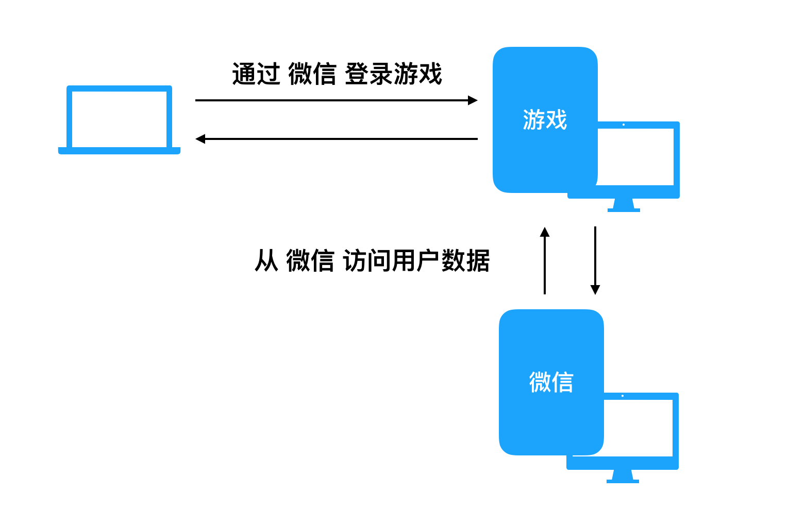
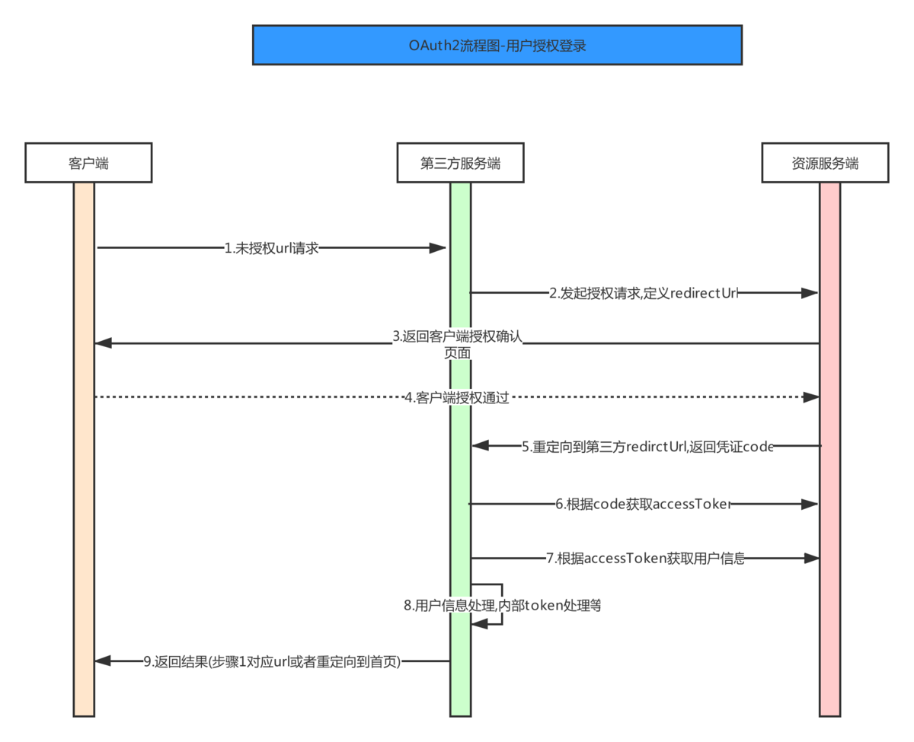
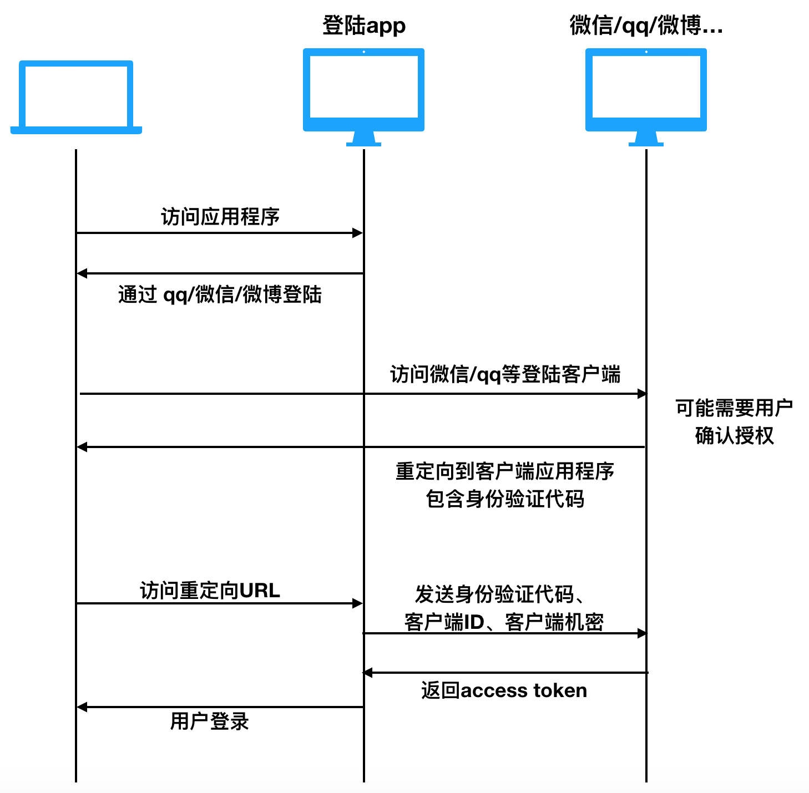
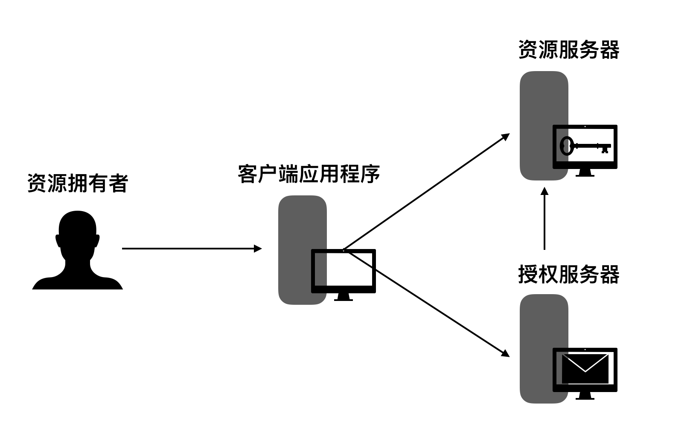
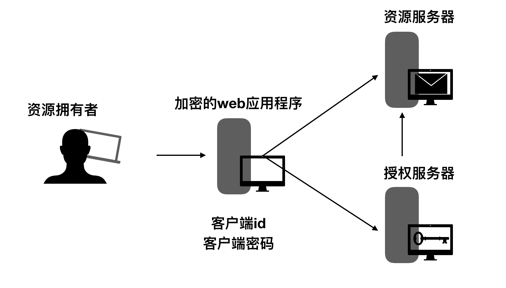
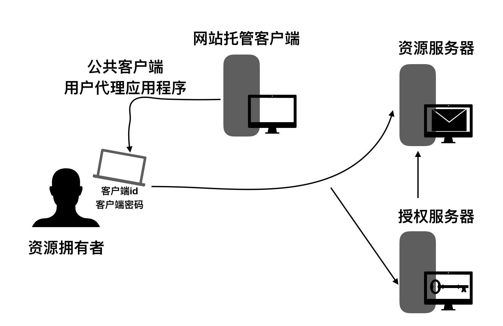
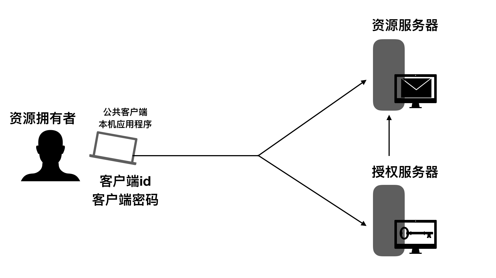
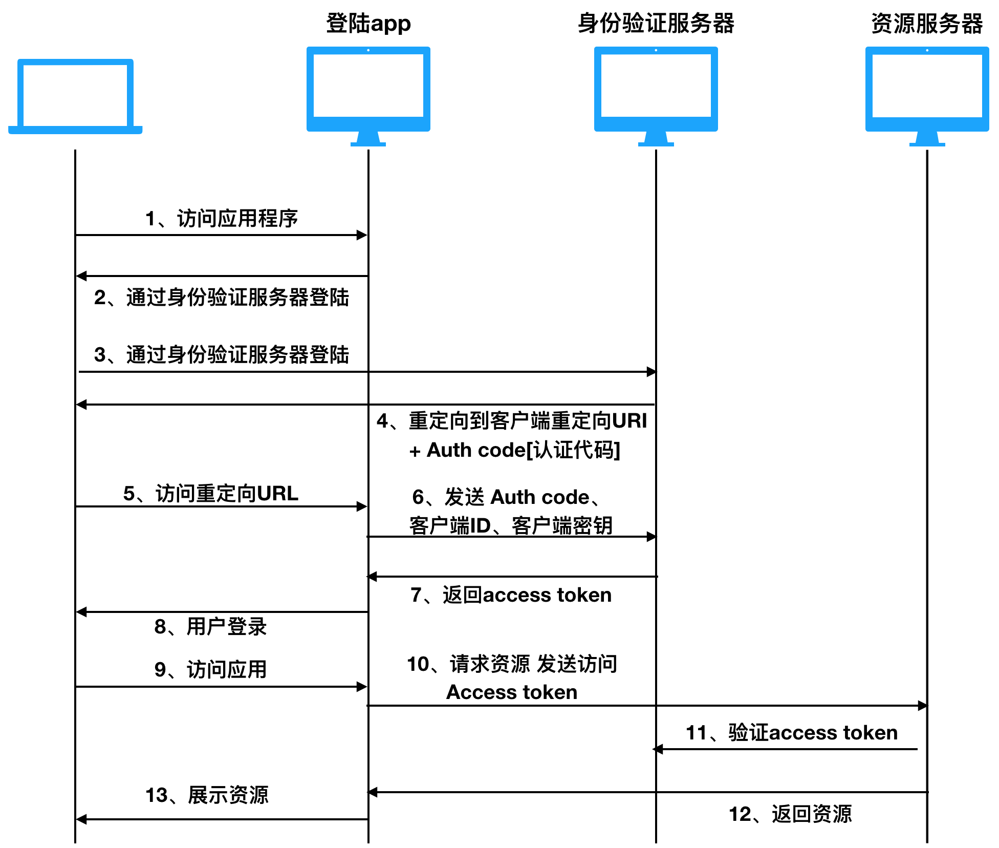
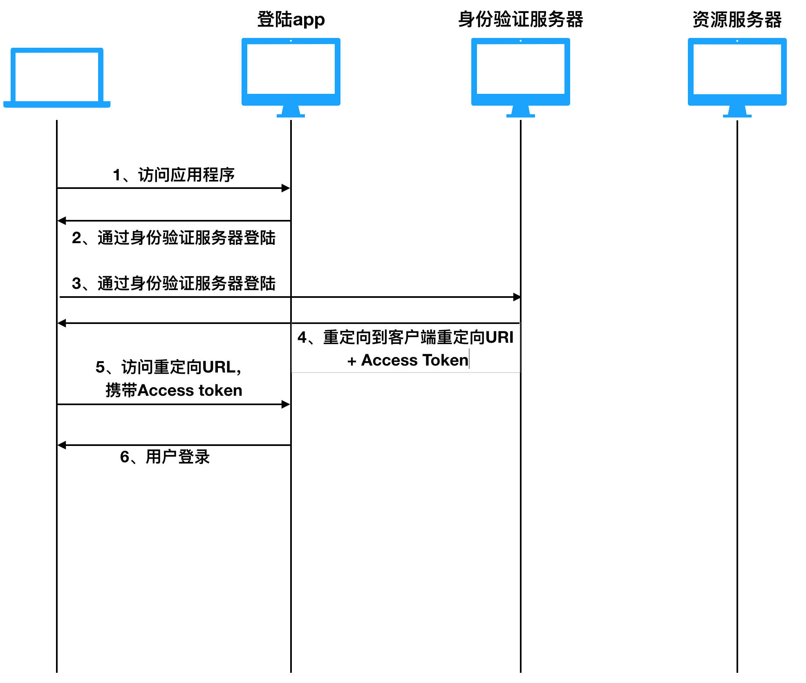
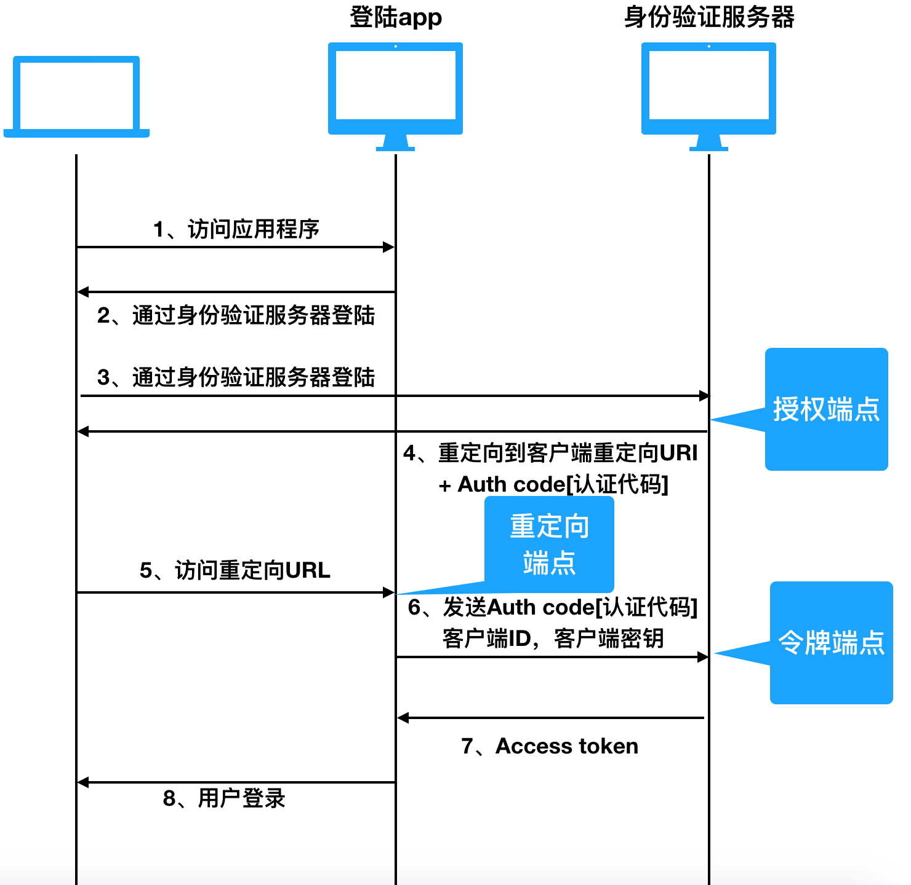

# OAuth2介绍与使用

## 一、什么是OAuth2

&emsp;&emsp;`OAuth（Open Authorization，开放授权）`是为用户资源的授权定义了一个安全、开放及简单的标准，第三方无需知道用户的账号及密码，就可获取到用户的授权信息。

&emsp;&emsp;如果想要更全面的学习Oauth2.0规范：[点击查看](http://tools.ietf.org/html/draft-ietf-oauth-v2-23)



## 二、应用场景

&emsp;&emsp;用户访问web游戏应用，该游戏应用要求用户通过微信登录。用户登录到微信，在重定向回游戏应用，游戏应用就可以访问用户在卫星的数据了，并且该应用可以代表用户向微信调用api【如发送状态更新】。


## 三、运作流程




**以下是简化的授权流程【来源：3cs】：**



**描述：**

1. 用户访问客户端web应用，点击了通过`qq`登录或其他。
2. 点击按钮之后，会被重定向到授权的应用【qq】，用户登录并确认授权应用中的数据给客户端应用。
3. **授权应用将用户重定向到客户端应用提供的URL**，*提供这种重定向的URL通常是通过注册客户端应用程序与授权应用程序完成。在注册中，客户端应用的拥有者组织该重定向`URL`,在注册过程中认证应用也会给客户端标示和密码*。**【在URI后追加一个认证码，该认证码代表了授权。】**
4. 用户被重定向到了指定`URL`，在背后客户端连接授权应用，并且发送在重定向请求参数中接收到的客户端标识【客户端密码和认证吗】，授权应用将返回一个访问口令。一旦客户端又了访问口令。便可以访问登录用户的资源了【qq/微信的】。


## 四、OAuth2中的角色

### 4.1 OAuth 2.0为用户和应用定义了如下角色：

- **资源拥有者**：拥有共享数据的人或应用。比如说微信或者是qq的用户。图中描述为人，也可以是一个应用。
- **资源服务器**：托管资源的服务器，例如：qq、微信就是资源服务器【或者说其有资源服务器】
- **客户端应用**：想要获取资源服务器上资源的应用。例如：一个通过微信授权的第三方游戏
- **授权服务器**：只有授权客户端应用能够访问资源拥有者所拥有的资源。对应用授权鉴权。




## 五、OAuth2客户端类型

&emsp;&emsp;OAuth2客户端角色被细化分为一系列类型和配置，OAuth2规范定义了两种客户端类型：

- 保密的客户端：对外部保持客户端密码保密。该客户端密码是由授权服务器分配给客户端应用的。为了避免欺骗。该密码是授权服务器用来识别客户端的。
- 公有的客户端：不能使客户端密码保密。这样的应用可能被破解，并且泄漏密码。


### 5.1 客户端配置

&emsp;&emsp;OAuth2规范也提到了一系列客户端配置文件：

- web应用
- 用户代理
- 原生


#### 5.1.1 Web应用

&emsp;&emsp;运行在Web服务器内的应用，B/S架构，如果Web应用需要访问资源服务器，然后客户端密码被保存在服务器上。密码保密。



#### 5.1.2 用户代理应用

&emsp;&emsp;用户代理应用比如运行在浏览器上`js`应用。浏览器是用户代理。用户代理程序可以保存在web服务器上，但应用程序只运行一次下载的用户代理。



#### 5.1.3 原生应用

&emsp;&emsp;桌面应用或移动手机应用，应用被安装在用户的设备上，客户端密码也被存储在用户设备上。



#### 5.1.4 混合应用

&emsp;&emsp;有些应用是这些配置混合使用，比如本地应用也可以有服务器部分。OAuth2规范没有提及这种混合型。


## 六、OAuth2授权

&emsp;&emsp;当一个客户端应用想要访问拥有者托管的资源服务器的资源时，它必须先获得授权。


### 6.1 客户端标识，客户端密钥和重定向URI

&emsp;&emsp;在客户端能请求访问资源服务器的资源之前，客户端应用程序必须先在资源服务器相关联的授权服务器中进行注册【授权】。

> 注册【授权】是一个一次性的任务，一旦注册了，除非客户端注册被取消了，注册将持续有效。

&emsp;&emsp;注册后客户端应用将由授权服务器分配`客户端标识`和`密钥`。在授权服务器上，客户端标识和密钥是唯一标识客户端应用的。如果客户端应用注册了多个授权服务器，每个客户端将发出唯一的标识给客户端。

&emsp;&emsp;无论什么时候客户端应用，想要访问同样资源服务器上的资源，它都需要通过发送客户端标识和密钥到授权服务器来验证自己。

&emsp;&emsp;在注册过程中，客户端应用也注册了一个重定向URL，当资源拥有者授权给客户端应用时，该重定向URL会被使用。当资源拥有者成功的通过授权服务器授权给客户端应用时，资源拥有者被重定向回客户端应用，在跳转到该重定向的`URI`。

### 6.2 授权批准

&emsp;&emsp;授权批准由资源服务器，及与其相关的授权服务器，给予客户端应用。

&emsp;&emsp;OAuth2列举四种不同类型的授权批准，每一种类型都有不同的安全特性：

- **授权码**
- **契约**
- **资源拥有者密钥证书**
- **客户端证书**


#### 6.2.1 授权码

&emsp;&emsp;资源拥有者(用户)访问客户端应用，客户端应用告诉用户通过授权服务器来登陆到客户端应用。

&emsp;&emsp;为了通过授权服务器登陆，用户通过客户端应用被重定向到授权服务器。客户端应用发送他的客户端标识给授权服务器，那么授权服务器就知道是哪个应用尝试访问受保护的资源。当被重定向回客户端时，授权服务器发送用户`特定的重定向URL`，即客户端已经提前与授权服务器注册。随着重定向，授权服务器发送一个代表授权的授权码。

&emsp;&emsp;当在客户端应用的重定向URI被访问时，客户端应用直接连接授权服务器。客户端应用发送授权码，客户端标识及密钥，如果客户端应用能接受这些值，那么授权服务器返回一个访问令牌。

&emsp;&emsp;现在客户端应用就可以用该访问令牌请求资源服务器的资源了。如下图：




#### 6.2.2 契约

&emsp;&emsp;契约授权类类似于授权码授权，除了用户完成授权后，访问令牌返回给客户端应用外。当用户被重定向到URI时，访问令牌因此被返回。

&emsp;&emsp;这意味着访问令牌可以被用户代理访问，或者在契约授权过程中参与的原生应用。访问令牌在web服务器上不是安全存储。

&emsp;&emsp;客户端应用可以只发送他的客户端标识给授权服务器，如果客户端也发送他的密钥，那么客户端密钥将不得不保存在用户代理或原生应用里，那么使它非常容易被破解。

&emsp;&emsp;契约授权大多数用在用户代理或原生应用中。用户代理或原生应用将收到来授权服务器的访问令牌。

**契约授权图解：**




#### 6.2.3 资源拥有者密钥证书

&emsp;&emsp;资源拥有者证书授权方法通过客户端应用访问资源拥有者证书来工作。比如，用户可以在客户端应用输入他的Twitter用户名及密钥(证书)。该客户端应用就可以用着用户名和密钥访问用户在Twitter的资源。

&emsp;&emsp;用资源拥有者密钥证书要求客户端应用信任，不能再可能会滥用证书的客户端应用中输入证书。

**通常被用在用户代理或原生应用中。**


#### 6.2.4 客户端证书

&emsp;&emsp;客户端证书授权对于客户端需要在资源服务器访问资源或调用函数的情况使用，与特定的资源拥有者无关（如用户）。比如，从Foursquare获取场地列表，这并没有必要通过某个Foursquare用户才能做。


## 七、OAuth2端点

&emsp;&emsp;OAuth2定义了一些列的端点。端点的典型就是web服务器上的URI，比如一个Java Servlet，JSP page，php Page，ASP.net网页等等。

**端点定义有：**

- **授权端点**：资源拥有者所登陆的授权服务器，并授权给客户端应用的端点。
- **令牌端点**：在授权服务器上为了生成一个访问令牌，客户端应用要交换授权码，客户端标识和客户端密钥的端点。
- **重定向端点**：授权端点授权以后，资源拥有者被重定向到客户端应用的端点。

> 授权端点和令牌端点都位于授权服务器上，重定向端点位于客户端应用上。




## 八、OAuth2请求和相应

&emsp;&emsp;当客户端应用请求授权和访问令牌时，它发送`http`请求到授权服务器，同它的授权和令牌端点。被发送来回的请求和相应取决于授权类型。

**四种授权类型:**

- 授权码授权
- 契约授权
- 资源拥有者密钥证书授权
- 客户端证书授权


### 8.1 授权码授权

&emsp;&emsp;授权码授权总共有2个请求和两个相应组成，一个`授权`请求 + 响应，和一个`令牌`请求 + 响应。


#### 8.1.1 授权请求：

&emsp;&emsp;授权请求被发送到授权端点以获取一个授权码。

| 参数                  | 描述                                         |
| --------------------- | -------------------------------------------- |
| `client_id`[必须]     | 当客户端被注册时，授权服务器要识别的客户端。 |
| `redirect_uri`        | 通过客户端注册的重定向URI                    |
| `scope`               | 请求可能的作用域                             |
| `state`[推荐添加]     | 任何需要被传递到客户端请求的URI客户端的状态  |
| `response_type`[必须] | 必须被设置到代码里                           |


#### 8.1.2 授权成功响应：

&emsp;&emsp;包含需要用来获取访问令牌的授权码。

| 参数         | 描述                                                         |
| :----------- | ------------------------------------------------------------ |
| `code`[必须] | 授权码                                                       |
| `state`      | 如果出现在请求中，必须包含，如果有的话和客户端请求<br />中发送的`state`参数一致 |


#### 8.1.3 授权错误响应


**授权期间发生错误会出现两种情况**：

1. 客户端没有被授权或识别【比如：请求中错误的重定向URI】这种情况下，授权服务器没有必要重定向资源拥有者到重定向`URI`。而是通知资源拥有者发生了错误。
2. 客户端被正确地授权了，其他某些事情失败了，这种情况下错误的相应会被发送到客户端，包括`重定向URI`


**第二种情况的响应：**

| 参数                | 描述                                                    |
| ------------------- | ------------------------------------------------------- |
| `error`[必须]       | 必须是预先定义的错误码之一。【可在规范中找到】          |
| `error_description` | 一段`UTF-8`编码的描述错误的文本。适合开发者，而不是用户 |
| `error_uri`         | 一个指定包含人类可读的错误信息网页URI.                  |
| `state`[必须]       | 如果出现在授权请求中，那么和请求中的`state`参数一致     |


#### 8.1.4 令牌请求

&emsp;&emsp;一旦授权码被获取到了，客户端可以用它获取访问令牌。

**请求参数：**

| 参数                 | 描述                                          |
| -------------------- | --------------------------------------------- |
| `grant_type`[必须]   | 必须被设置到授权码中                          |
| `code`[必须]         | 被授权服务器接收到的授权码                    |
| `redirect_uri`[必须] | 如果请求URI包括在授权请求中，之后必须是相同的 |


#### 8.1.5 令牌响应

&emsp;&emsp;访问令牌的响应是包含访问令牌及一些更多信息的`JSON字符串`：

```json
{ 
  "access_token"  : "...",
  "token_type"    : "...",
  "expires_in"    : "...",
  "refresh_token" : "...",
}
```

| 属性                | 描述                                             |
| ------------------- | ------------------------------------------------ |
| `access_type`[必须] | 授权服务器分配的访问令牌                         |
| `token_type`[必须]  | 授权服务器分配的令牌类型                         |
| `expires_in`        | 访问令牌的有效时间【可选，单位：秒】             |
| `refresh_token`     | 刷新令牌，使用此令牌可以延长访问令牌的过期时间。 |


### 8.2 契约授权


#### 8.2.1 契约授权请求

| 参数                  | 描述                                           |
| --------------------- | ---------------------------------------------- |
| `response_type`[必须] | 必须被设置在令牌中                             |
| `client_id`[必须]     | 当客户端被注册时，有授权服务器分配的客户端标识 |
| `redirect_uri`        | 由客户端注册的重定向`URI`                      |
| `scope`               | 请求可能的作用域                               |
| `state`[推荐]         | 任何需要被传递到客户端请求的URI客户端的状态    |


#### 8.2.2 契约授权响应

| 参数                 | 描述                             |
| -------------------- | -------------------------------- |
| `access_token`[必须] | 授权服务器分配的访问令牌         |
| `token_type`[必须]   | 令牌类型                         |
| `expires_in`[推荐]   | 访问令牌过期时间【单位：秒】     |
| `scope`              | 访问令牌作用域                   |
| `state`[必须]        | 请求中存在的话，必须与请求的一致 |


#### 8.2.3 契约授权错误

&emsp;&emsp;授权期间的错误也分为两种，一种是还没有授权或识别就发生了错误。第二种是客户端是好的，但是发生了其他事情。这种时候会发送一下响应：

| 参数                | 描述                                                |
| ------------------- | --------------------------------------------------- |
| `error`[必须]       | 必须是需要定义的错误码之一。规范中有定义            |
| `error_description` | 描述错误的文本[UTF-8]，适合于开发者，而不是最终用户 |
| `error_uri`         | 一个只想错误信息网页的URI                           |
| `state`[必须]       | 请求中存在的话，必须与请求的一致                    |


### 8.3 资源拥有者密钥证书授权


#### 8.3.1 资源拥有者密钥证书授权请求

| 参数               | 描述                        |
| ------------------ | --------------------------- |
| `grant_type`[必须] | 必须设置到密码中            |
| `username`[必须]   | 资源拥有者的用户名【UTF-8】 |
| `password`[必须]   | 资源拥有者的密码【UTF-8】   |
| `scope`            | 授权的作用域                |


#### 8.3.2 资源拥有者密钥证书授权响应

```json
{ 
  "access_token"  : "...",
  "token_type"    : "...",
  "expires_in"    : "...",
  "refresh_token" : "...",
}
```

| 参数                | 描述                                             |
| ------------------- | ------------------------------------------------ |
| `access_type`[必须] | 授权服务器分配的访问令牌                         |
| `token_type`[必须]  | 访问令牌的类型                                   |
| `expires_in`        | 令牌的生效时间【单位：秒】                       |
| `refresh_token`     | 刷新令牌，使用此令牌可以延长访问令牌的过期时间。 |


### 8.4 客户端证书请求和响应


#### 8.4.1 客户端证书请求：

| 参数           | 描述                   |
| -------------- | ---------------------- |
| `grant_type`[] | 必须设置到客户端证书中 |
| `scope`        | 授权的作用域           |

#### 8.4.2 客户端证书响应：

```json
{ 
  "access_token"  : "...",
  "token_type"    : "...",
  "expires_in"    : "...",
}
```

| 参数                 | 描述                       |
| -------------------- | -------------------------- |
| `access_token`[必须] | 授权服务器分配的访问令牌   |
| `token_type`[必须]   | 访问令牌的类型             |
| `expires_in`         | 令牌的过期时间【单位：秒】 |

